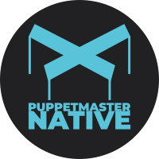

<div align="center"></div>

<div align="center">

[](LICENSE)
[](https://github.com/ldco/PuppetMasterNative/releases)
[](https://github.com/ldco/PuppetMasterNative/actions)
[](https://www.typescriptlang.org/)

</div>

# PMNative

Config-driven Expo/React Native starter with provider-based auth (Supabase-first) and built-in admin/RBAC scaffolding.

## Introduction

PMNative helps teams ship a mobile app foundation quickly without rebuilding the same auth, navigation, admin, and UI primitives every time.

It is for developers who want:

- an Expo + React Native app that runs immediately
- a backend-agnostic auth architecture
- a structured component system (atoms/molecules/organisms)
- admin and role-based patterns already wired into the app shell

Why it exists:

- to preserve the useful app framework patterns extracted from Puppet Master
- to make them reusable in a standalone, backend-flexible project
- to give new contributors a predictable starting point with strong DX

## Features

- `Expo Router` app structure with typed routes enabled
- Provider-based auth contract (`supabase` default, `generic-rest` supported)
- Supabase auth integration (sign in, sign up, forgot password, session handling)
- Config-driven app features, navigation, theme, and RBAC
- Atomic component library (`atoms`, `molecules`, `organisms`)
- Admin module scaffolding and diagnostics screen support
- TypeScript-first codebase with a `typecheck` script

## 🚀 Quick Start

This is the fastest path to a running app using the default `supabase` provider.

### Prerequisites

Why: PMNative runs on Expo, so you need Node/npm to install dependencies and an Expo-compatible runtime to launch the app.

- Node.js (LTS recommended)
- npm (bundled with Node.js)
- A Supabase project (for the default auth provider)
- One runtime target:
  - Expo Go on a phone, or
  - iOS Simulator / Android Emulator, or
  - a web browser (for quick local validation)

### Installation

Why: this installs the app and all dependencies used by Expo, React Native, and Supabase auth.

```bash
git clone https://github.com/ldco/PuppetMasterNative.git
cd PuppetMasterNative
npm install
```

### Environment Setup

Why: the default backend provider is `supabase`, and the app reads credentials from Expo public env variables.

Framework-first note:

- Real Supabase values are only required for live integration testing.
- For framework development (architecture, UI, provider contracts, docs), placeholders are acceptable and expected.

1. Copy the example environment file:

```bash
cp .env.example .env
```

2. Update `.env` with your Supabase project values:

```bash
EXPO_PUBLIC_SUPABASE_URL=https://[YOUR_PROJECT_REF].supabase.co
EXPO_PUBLIC_SUPABASE_ANON_KEY=[YOUR_SUPABASE_ANON_KEY]

# Optional (only used if you switch provider to generic-rest)
EXPO_PUBLIC_API_BASE_URL=https://[YOUR_API_BASE_URL]
```

If you are not doing live auth testing yet, keep placeholders and focus on `npm run typecheck` + framework implementation work.

`.env.example` included in this repo:

```bash
# PMNative (Expo) environment variables
# Copy to your local env workflow (.env, .env.local, or Expo secrets) as needed.

# Default backend provider: Supabase
EXPO_PUBLIC_SUPABASE_URL=https://your-project-ref.supabase.co
EXPO_PUBLIC_SUPABASE_ANON_KEY=your-supabase-anon-key

# Optional: only needed when backend.provider = 'generic-rest'
EXPO_PUBLIC_API_BASE_URL=https://api.your-domain.com
```

### Run Locally

Why: this starts the Expo dev server with the app router root configured to `src/app`.

```bash
npm run start
```

Before choosing a target, you can run a local environment preflight:

```bash
npm run doctor:local
```

Recommended bootstrap check (local doctor + Expo doctor + typecheck):

```bash
npm run setup
```

Recommended phone flow (Expo Go, same Wi-Fi/LAN):

```bash
npm run phone
```

Optional launch targets (same project, same config):

```bash
npm run tunnel
```

```bash
npm run web
```

```bash
npm run ios
```

```bash
npm run android
```

Notes:

- `npm run phone` uses Expo LAN mode and does not require Android SDK or `adb`.
- `npm run tunnel` uses Expo tunnel mode and depends on `@expo/ngrok` + network availability.
- `npm run android` launches via `adb` and requires a working Android SDK installation.
- `npm run setup` runs `doctor:local`, `doctor:expo`, and `typecheck` as a preflight bootstrap pass.

### ✅ Success Check

You should now see:

- an Expo dev server running in your terminal
- a QR code (for Expo Go) or prompt shortcuts (`w`, `i`, `a`)
- the app opening to the PMNative auth flow/navigation shell when launched

If you open the app and go to Admin Settings, you should see backend diagnostics showing:

- active provider: `supabase`
- whether required env vars are present

## Usage

### Run on Web for Fast UI Validation

```bash
npm run web
```

Expected result:

- a browser window opens with the Expo web build of PMNative

### Run Type Checking

```bash
npm run typecheck
```

Expected result:

- TypeScript exits with no errors

### Switch Auth Provider (Advanced)

PMNative is backend-agnostic at the auth layer. The active provider is configured in `src/pm-native.config.ts`.

Default (recommended for first run):

```ts
backend: {
  provider: 'supabase',
  // ...
}
```

Alternative (requires your own backend endpoints):

```ts
backend: {
  provider: 'generic-rest',
  // ...
}
```

When using `generic-rest`, set `EXPO_PUBLIC_API_BASE_URL` and ensure the auth endpoints match the contract documented in `docs/GENERIC_REST_AUTH_PROVIDER_CONTRACT.md`.

## Configuration

### Environment Variables

| Key | Description | Default | Required |
| --- | --- | --- | --- |
| `EXPO_PUBLIC_SUPABASE_URL` | Supabase project URL used by the default auth provider | None | Yes (for `supabase`) |
| `EXPO_PUBLIC_SUPABASE_ANON_KEY` | Supabase anon/public key used by the client | None | Yes (for `supabase`) |
| `EXPO_PUBLIC_API_BASE_URL` | Base URL for the `generic-rest` provider | `https://api.example.com` (from `src/pm-native.config.ts`) | Only if `backend.provider = 'generic-rest'` |

### Runtime Config (Code)

Primary runtime configuration lives in `src/pm-native.config.ts`.

| Key | Description | Default | Required |
| --- | --- | --- | --- |
| `backend.provider` | Auth backend implementation | `supabase` | Yes |
| `features.auth` | Enables auth flows/screens | `true` | Yes |
| `features.registration` | Enables registration flow | `true` | No |
| `features.forgotPassword` | Enables forgot-password flow | `true` | No |
| `features.admin` | Enables admin area | `true` | No |
| `api.timeoutMs` | API timeout for generic API requests | `10000` | No |

## Project Structure

Simplified layout (most important folders only):

```text
.
├── docs/                          # Setup, provider contracts, architecture notes
├── src/
│   ├── app/                       # Expo Router routes (auth, tabs, admin)
│   ├── components/
│   │   ├── atoms/
│   │   ├── molecules/
│   │   └── organisms/
│   ├── hooks/                     # App hooks (auth, config, diagnostics, toast)
│   ├── services/
│   │   ├── auth/
│   │   │   ├── provider.ts
│   │   │   ├── provider.types.ts
│   │   │   └── providers/         # supabase + generic-rest auth providers
│   │   ├── api.ts
│   │   └── supabase.client.ts
│   ├── stores/                    # Zustand stores
│   ├── theme/                     # Tokens + semantic theme config
│   ├── types/
│   └── pm-native.config.ts        # Core runtime configuration
├── .env.example
├── app.json                       # Expo app config
├── package.json
└── README.md
```

## Contributing

Why: consistent local validation reduces review churn and prevents avoidable regressions.

### Local Validation

Install dependencies first:

```bash
npm install
```

Run the current quality gate:

```bash
npm run typecheck
```

Tests:

- A dedicated automated test script is not defined in `package.json` yet.
- Use `npm run typecheck` and manual app verification (`npm run web` or `npm run start`) before opening a PR.

### Commit / PR Expectations

- Keep PRs focused (one feature/fix per PR)
- Include setup/config notes if your change affects onboarding or env vars
- Update docs when changing provider contracts or runtime config behavior
- Include screenshots or short recordings for UI changes when possible

## Troubleshooting / FAQ

### `npm install` fails or native packages do not resolve

Why it happens:

- Node version mismatch
- corrupted lockfile or `node_modules`

Fix:

```bash
rm -rf node_modules package-lock.json
npm install
```

If the issue continues, verify you are using a current Node.js LTS release.

### App says Supabase config is missing / auth does not work

Why it happens:

- `.env` was not created
- `EXPO_PUBLIC_SUPABASE_URL` or `EXPO_PUBLIC_SUPABASE_ANON_KEY` is missing/invalid

Fix:

```bash
cp .env.example .env
```

Then confirm both Supabase values are set in `.env`, restart the dev server, and check Admin Settings diagnostics in-app.

### Expo starts but the app does not load correctly (stale cache / bundler issue)

Why it happens:

- Metro cache can hold stale route/module state after config changes

Fix:

```bash
npm run start -- --clear
```

Then relaunch your target (`w`, `i`, or `a`) from the Expo terminal.

### Expo warns about dependency compatibility (expected package versions)

Why it happens:

- one or more native dependencies drifted from the Expo SDK-compatible versions

Fix:

```bash
npm run doctor:expo
```

If Expo reports specific package versions, align them with:

```bash
npx expo install <package names>
```

### `npm run android` fails with `adb ENOENT` or Android SDK path errors

Why it happens:

- Android SDK is not installed, or
- `ANDROID_HOME` / `ANDROID_SDK_ROOT` is not set, or
- `adb` (`platform-tools`) is not on `PATH`

Fix:

```bash
npm run doctor:local
```

The `npm run android` wrapper now auto-detects common SDK paths (including `~/Android/Sdk`) and injects them for the Expo process, but it still requires a real SDK + platform-tools installation.

If you are running on a physical phone with Expo Go, use LAN mode instead:

```bash
npm run phone
```

### `npm run tunnel` fails (`remote gone away`, ngrok install error, tunnel not starting)

Why it happens:

- temporary ngrok outage or network issue
- `@expo/ngrok` is not installed (or could not be installed globally)
- `npm` global prefix is not writable (common when prefix is `/usr`)

Fix:

```bash
npm run doctor:local
```

Then:

- retry with cache clear: `npm run tunnel -- --clear`
- prefer LAN mode on the same Wi-Fi: `npm run phone`
- check ngrok status: `https://status.ngrok.com/`

## License & Contact

### License

This project is licensed under the GNU General Public License v3.0 (`GPL-3.0-only`). See `LICENSE`.

### Contact

- GitHub Issues: `https://github.com/ldco/PuppetMasterNative/issues`
- Maintainer: [ldco](https://github.com/ldco)
