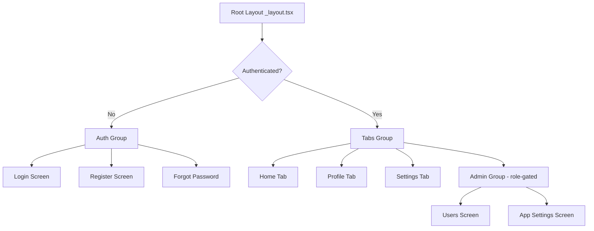
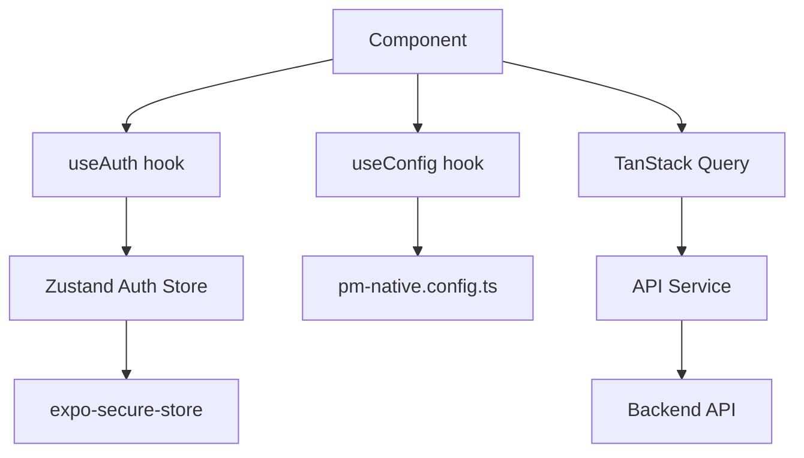
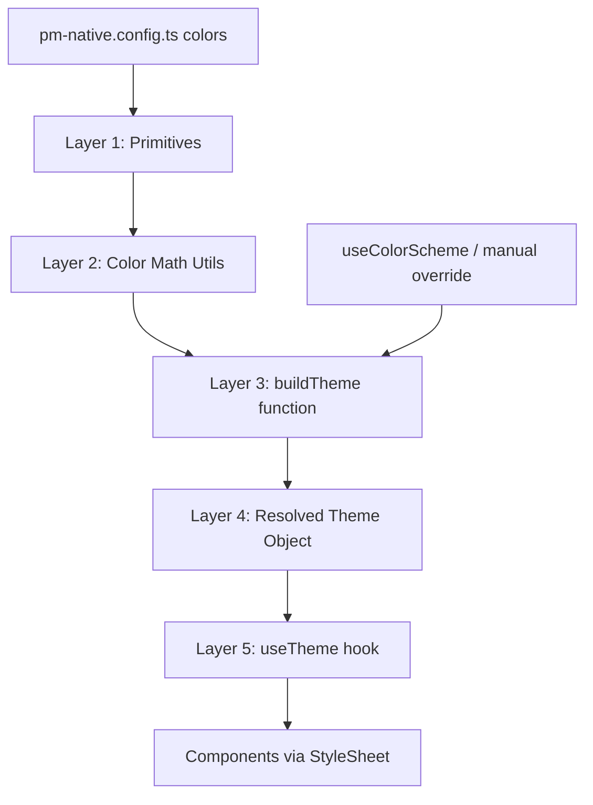
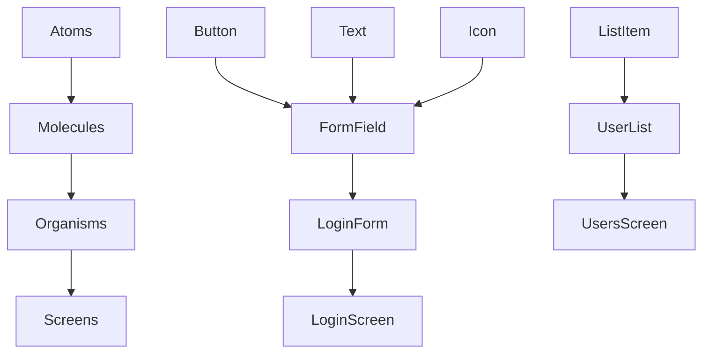
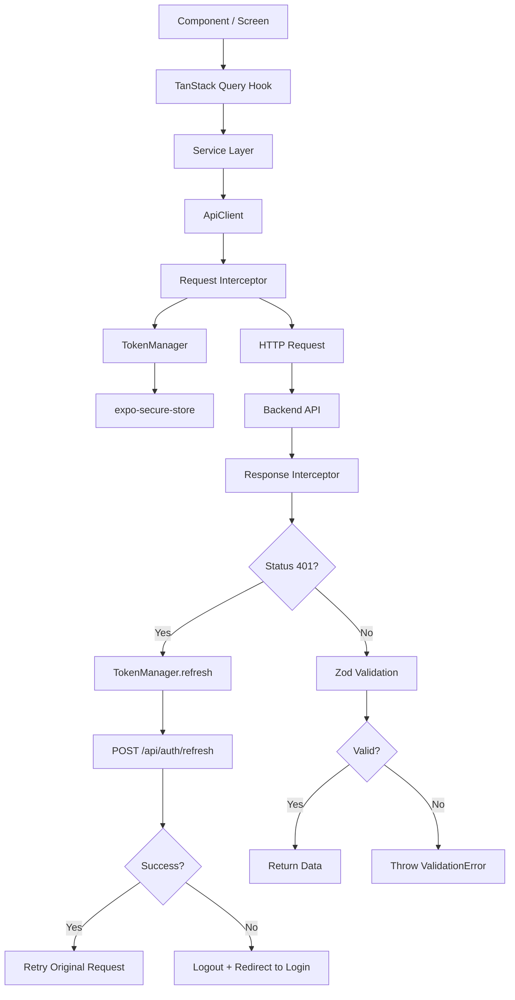
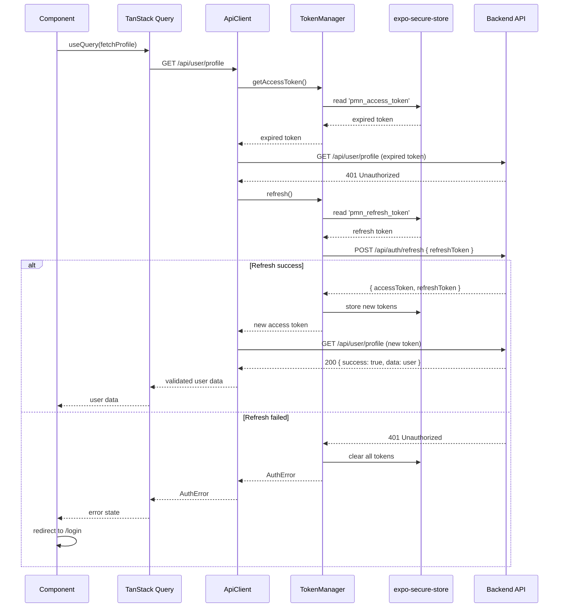
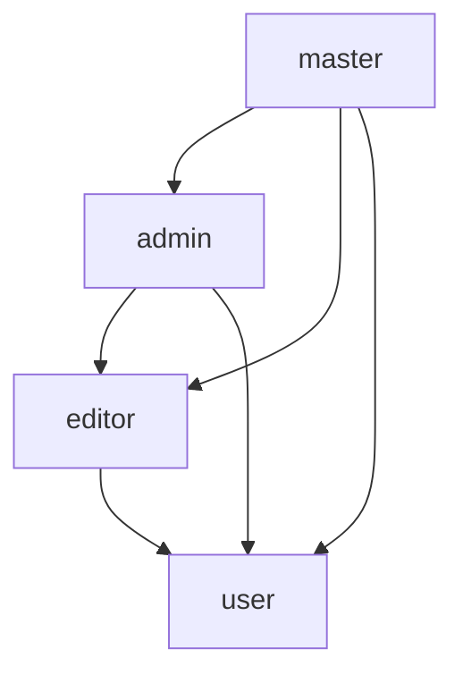
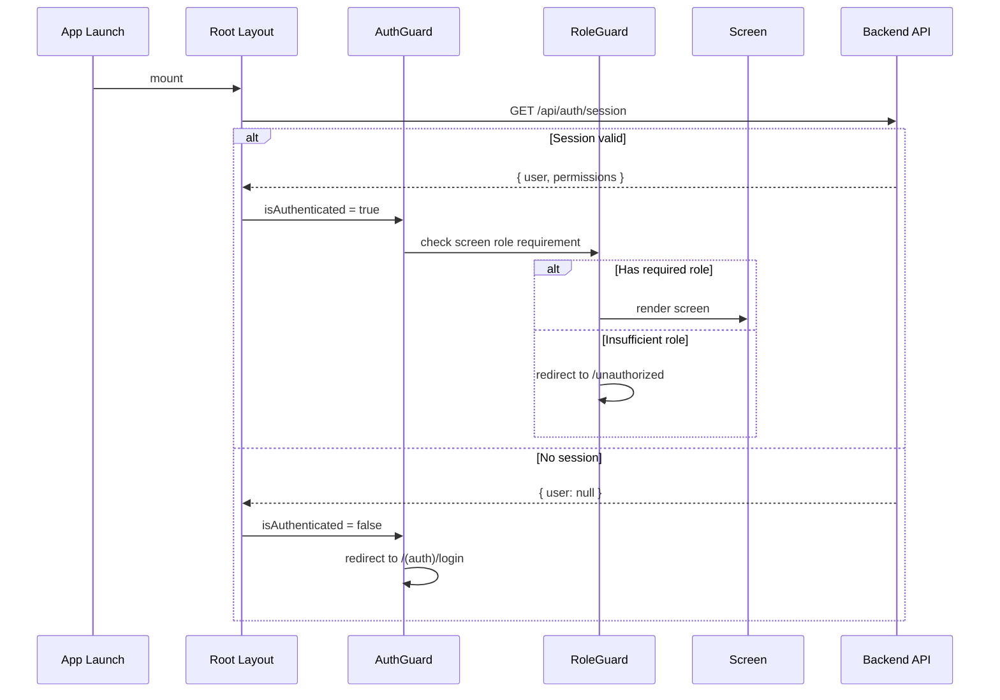

# PMNative Architecture Proposal — React Native Framework Design

# PMNative Architecture Proposal — React Native Framework Design

> **PMNative** is a mobile-first framework for bootstrapping React Native apps extremely fast. It inherits the conceptual DNA of Puppet Master — config-first, atomic design, typed and validated, security-first — but is designed from the ground up for native mobile product development.
>
> **Core values:** Performance-obsessed. Universal by default. Every device. Every surface. Out of the box.

---

## 1. PMNative Vision & Identity

### 1.1 Framework Identity

PMNative is **not** a React Native port of PM Framework. It is a new framework that:

- Treats **iOS and Android as first-class citizens**
- Treats **web as a supported secondary target** (via React Native Web)
- Ships with **everything a mobile app needs out of the box**
- Allows a developer to go from zero to a working, production-ready app shell in **under an hour**
- Is **config-driven** — one file controls the entire app structure
- Is **performance-obsessed** — speed is a feature, not an afterthought
- Targets **every surface out of the box** — phone, tablet, web, desktop, TV — no extra configuration needed
- Respects **every device** — flagship and old alike; fast on new, functional on old, broken on neither

### 1.2 Developer Experience Goals

| Goal | Description |
|---|---|
| **Zero-to-app in minutes** | Clone, configure `pm-native.config.ts`, run — get a working app |
| **Config-first** | All structural decisions live in one config file |
| **No boilerplate** | Auth, navigation, theming, API layer — all pre-built |
| **Atomic discipline** | Components follow a strict hierarchy; no spaghetti |
| **Type-safe everywhere** | TypeScript + Zod; no `any`, no guessing |
| **Mobile-native UX** | Gestures, haptics, safe areas, keyboard avoidance — handled |
| **Performance by default** | Every architectural decision optimizes for speed; slow is not an option |
| **Universal out of the box** | Phone, tablet, web, TV — all surfaces work without extra configuration |

### 1.3 Mobile-First Philosophy

PMNative makes the following **explicit design decisions**:

- Navigation is **screen-based**, not URL-based
- Layout uses **safe area insets**, not viewport units
- Touch targets are **minimum 44×44pt** by default
- Animations use **native driver** by default
- Keyboard behavior is **handled automatically**
- Platform differences (iOS vs Android) are **abstracted**, not ignored

### 1.4 Performance as a Core Value

> **"Fast on flagship. Acceptable on old. Never broken on either."**

Performance is not a feature to be added later. It is a **founding principle** baked into every layer of PMNative:

- **Hermes engine** is required — no JSC fallback
- **`StyleSheet.create()` is mandatory** — inline style objects are forbidden
- **Native driver is the default** — JS-thread animations are the exception
- **List virtualization is built-in** — the `List` atom enforces FlatList best practices
- **`expo-image` replaces `Image`** — disk cache, blurhash, WebP, lazy loading by default
- **Lazy screen loading** — Expo Router loads screens on demand, not upfront
- **Old devices are respected** — graceful degradation via `reduceMotion` and device tier detection; no hard SDK floor

Every PMNative component, hook, and utility is written with performance as a constraint, not a consideration.

### 1.5 Universal Surface Targeting as a Core Value

> **"One codebase. Every screen. Out of the box."**

PMNative ships with responsive support for **all 5 surfaces** — no plugins, no extra config, no separate codebases:

| Surface | Width | Status |
|---|---|---|
| 📱 **Phone** | < 640dp | 🥇 Primary design target |
| 📱 **Tablet** | 640–1023dp | 🥈 Adapted layout, out of the box |
| 🌐 **Web** | 640–1279dp | 🥉 Supported, mobile-first in browser |
| 🖥️ **Desktop** | ≥ 1024dp | 🥉 Split-pane layout, out of the box |
| 📺 **TV** | ≥ 1280dp | 🥉 D-pad navigation, large text, out of the box |

This is powered by PMNative's **Universal Responsive System** (§13) — a direct translation of PM Framework's "2025 Holy Grail" responsive philosophy into React Native. The same breakpoints, the same fluid spacing, the same container-query pattern — just in JavaScript instead of CSS.

The style system inherited from PM Framework is **obsessed with responsiveness**. That obsession carries forward into PMNative in full.

---

## 2. Technology Stack

| Concern | Technology | Rationale |
|---|---|---|
| **Framework** | Expo (managed workflow) | Cross-platform, OTA updates, native modules |
| **Language** | TypeScript (strict) | Same as PM Framework |
| **Routing** | Expo Router (file-based) | Mirrors Nuxt's file-based routing philosophy |
| **State (client)** | Zustand | Lightweight, similar to Pinia in philosophy |
| **State (server)** | TanStack Query (React Query) | Caching, sync, offline support |
| **Styling** | StyleSheet + Design Tokens | No CSS; JS token system mirrors PM's CSS token philosophy |
| **Storage** | MMKV (via expo-mmkv) | Fast key-value storage; replaces AsyncStorage |
| **Validation** | Zod | Same as PM Framework |
| **i18n** | i18next + react-i18next | Bundled translations + optional remote sync |
| **Icons** | @expo/vector-icons + Tabler | Mirrors PM's Tabler icon usage |
| **Notifications** | expo-notifications | Push notifications |
| **Permissions** | expo-permissions | Device permissions |
| **Secure Storage** | expo-secure-store | JWT tokens, sensitive data |
| **Testing** | Jest + React Native Testing Library | Unit + integration tests |
| **Animations** | react-native-reanimated | Worklet-based 60fps animations; PM easing curves translated |
| **Images** | expo-image | Disk+memory cache, blurhash, WebP, lazy loading |
| **Color math** | culori | OKLCH/sRGB color space conversions (mirrors PM's postcss-preset-env math) |
| **Backend (default)** | @supabase/supabase-js | Default backend adapter; any REST/GraphQL also supported |

---

## 3. Core Architecture

### 3.1 Folder Structure

```
pm-native/
├── src/
│   ├── app/                        # Expo Router screens (file-based)
│   │   ├── _layout.tsx             # Root layout (providers, theme)
│   │   ├── (auth)/                 # Auth group (no tab bar)
│   │   │   ├── _layout.tsx
│   │   │   ├── login.tsx
│   │   │   ├── register.tsx
│   │   │   └── forgot-password.tsx
│   │   ├── (tabs)/                 # Main app (tab bar)
│   │   │   ├── _layout.tsx         # Tab navigator config
│   │   │   ├── index.tsx           # Home tab
│   │   │   ├── profile.tsx         # Profile tab
│   │   │   └── settings.tsx        # Settings tab
│   │   └── (admin)/                # Admin screens (role-gated)
│   │       ├── _layout.tsx
│   │       ├── users.tsx
│   │       └── settings.tsx
│   ├── components/
│   │   ├── atoms/                  # Single-purpose building blocks
│   │   ├── molecules/              # Combinations of atoms
│   │   └── organisms/              # Complex components with logic
│   ├── hooks/                      # use* hooks (composables equivalent)
│   │   ├── useAuth.ts
│   │   ├── useConfig.ts
│   │   ├── useTheme.ts
│   │   ├── useToast.ts
│   │   └── useConfirm.ts
│   ├── stores/                     # Zustand stores
│   │   ├── auth.store.ts
│   │   └── ui.store.ts
│   ├── services/                   # API & external services
│   │   ├── api.ts                  # Base API client (fetch wrapper + Zod)
│   │   ├── auth.service.ts         # Auth API calls
│   │   └── storage.service.ts      # MMKV abstraction
│   ├── theme/                      # Design token system
│   │   ├── tokens.ts               # Color, typography, spacing primitives
│   │   ├── semantic.ts             # Semantic token aliases
│   │   └── index.ts                # Theme export
│   ├── types/                      # TypeScript types
│   │   ├── auth.ts
│   │   ├── config.ts
│   │   └── index.ts
│   ├── utils/                      # Utilities
│   │   ├── validation.ts           # Zod schemas
│   │   └── platform.ts             # Platform abstraction helpers
│   └── pm-native.config.ts         # PMNative configuration (THE config file)
├── app.json                        # Expo app config
├── tsconfig.json
└── package.json
```

### 3.2 Navigation Architecture

PMNative uses **Expo Router** with a group-based navigation structure:



The navigation structure is **driven by `pm-native.config.ts`** — the config declares which tabs exist, their icons, and their role requirements.

### 3.3 State Management Architecture



- **Zustand** handles client-side state (auth user, UI state, preferences)
- **TanStack Query** handles server state (data fetching, caching, sync)
- **expo-secure-store** handles sensitive persistence (JWT tokens)
- **MMKV** handles fast non-sensitive persistence (settings, preferences)

---

## 4. Design Token System — Deep Design

> This section documents how PMNative's JavaScript token system precisely mirrors PM Framework's CSS token system. Every `color-mix()`, `light-dark()`, and `oklch()` CSS function has a direct JS equivalent.

### 4.0 The Translation Problem

PM Framework's style system relies on three CSS features that **do not exist in React Native**:

| CSS Feature | PM Framework Usage | React Native Equivalent |
|---|---|---|
| `light-dark(light, dark)` | Theme switching per-token | `mode === 'light' ? light : dark` |
| `color-mix(in oklch, A, B 5%)` | Neutral tint/shade generation | `mixOKLCH(A, B, 0.05)` |
| `color-mix(in srgb, A, B 15%)` | Brand/accent hover states | `mixSRGB(A, B, 0.15)` |
| `oklch(65% 0.2 145)` | Semantic color definition | `oklchToHex(0.65, 0.20, 145)` |
| CSS custom properties | Runtime token access | JS object properties |

The PMNative token system re-implements this math in TypeScript, producing the **same color values** as PM's CSS at build time.

### 4.1 Token System Architecture

The token system is organized in 5 layers — mirroring PM's 5 CSS layers:



```
theme/
├── utils/
│   ├── hex.ts        # Hex ↔ RGB conversion
│   ├── oklch.ts      # OKLCH ↔ sRGB conversion (mirrors postcss-preset-env math)
│   └── mix.ts        # color-mix() equivalents (sRGB and OKLCH)
├── primitives.ts     # The 4 color primitives (read from config)
├── semantic.ts       # buildTheme(primitives, mode) → SemanticTokens
├── typography.ts     # Font tokens (4-layer system, mirrors PM typography)
├── spacing.ts        # Spacing, radius, shadow, z-index tokens
└── index.ts          # ThemeProvider, useTheme() hook
```

### 4.2 The 4-Primitive System (Inherited from PM)

Identical to PM Framework's `colors/primitives.css` — the only values a developer changes to rebrand:

```ts
// theme/primitives.ts
// Mirrors: app/assets/css/colors/primitives.css
//
// --p-black: #2f2f2f
// --p-white: #f0f0f0
// --p-brand: #aa0000
// --p-accent: #0f172a

export interface ColorPrimitives {
  black:  string   // Charcoal — dark text / dark backgrounds
  white:  string   // Off-white — light text / light backgrounds
  brand:  string   // Primary brand color
  accent: string   // Secondary accent color
}

// Default primitives (same as PM Framework defaults)
export const defaultPrimitives: ColorPrimitives = {
  black:  '#2f2f2f',
  white:  '#f0f0f0',
  brand:  '#aa0000',
  accent: '#0f172a',
}
```

### 4.3 Color Math Utilities (`theme/utils/`)

These utilities are the JavaScript implementation of CSS color functions. They produce **identical output** to the CSS equivalents.

#### 4.3.1 Hex ↔ RGB Conversion (`hex.ts`)

Foundation for all color math:

```ts
// theme/utils/hex.ts
interface RGB { r: number; g: number; b: number }

function hexToRgb(hex: string): RGB
function rgbToHex(rgb: RGB): string
function hexToRgba(hex: string, alpha: number): string
```

#### 4.3.2 OKLCH ↔ sRGB Conversion (`oklch.ts`)

The most critical utility — implements the same math that `postcss-preset-env` applies at CSS build time. Required for semantic colors (`--d-success`, `--d-warning`, `--d-error`, `--d-info`) which are defined in OKLCH:

```ts
// theme/utils/oklch.ts
//
// Conversion pipeline:
//   OKLCH → OKLab → Linear sRGB → sRGB (gamma) → Hex
//
// Step 1: OKLCH → OKLab
//   a = C * cos(H * π/180)
//   b = C * sin(H * π/180)
//
// Step 2: OKLab → Linear sRGB (matrix multiply)
//   [l, m, s] = M1 * [L, a, b]
//   [r, g, b] = M2 * [l³, m³, s³]
//
// Step 3: Linear sRGB → sRGB (gamma correction)
//   channel = channel <= 0.0031308
//     ? 12.92 * channel
//     : 1.055 * channel^(1/2.4) - 0.055

function oklchToHex(L: number, C: number, H: number): string
function hexToOklch(hex: string): { L: number; C: number; H: number }
```

> **Recommendation:** Use the `culori` library (`npm install culori`) which implements all color space conversions correctly and is well-tested. The above describes the math it performs internally.

#### 4.3.3 Color Mixing (`mix.ts`)

Two mixing functions — one per color space — mirroring PM's deliberate color space choices:

```ts
// theme/utils/mix.ts
//
// ⚠️  CRITICAL: Color space choice matters — same rule as PM Framework:
//
//   mixSRGB  → for brand/accent colors (preserves hue)
//   mixOKLCH → for neutral colors (perceptually uniform)
//
// WHY: OKLCH mixing shifts red → pink, blue → purple.
// PM Framework's auto.css uses srgb for brand/accent for this exact reason.

/**
 * Mirrors: color-mix(in srgb, colorA, colorB amount%)
 * Use for: brand, accent, hover/active states
 * Preserves hue — safe for saturated colors
 */
function mixSRGB(colorA: string, colorB: string, amount: number): string
// amount = fraction of colorB (0.15 = 15% colorB, 85% colorA)

/**
 * Mirrors: color-mix(in oklch, colorA, colorB amount%)
 * Use for: neutral backgrounds, borders, text opacity
 * Perceptually uniform — safe for black/white mixing
 */
function mixOKLCH(colorA: string, colorB: string, amount: number): string

/**
 * Mirrors: color-mix(in oklch, color, transparent amount%)
 * Adds alpha channel to a color
 */
function alpha(color: string, opacity: number): string
// Returns rgba string: 'rgba(r, g, b, opacity)'
```

### 4.4 The `buildTheme()` Function — Mirroring `auto.css`

This is the core of the token system. It takes the 4 primitives and a mode, and returns the full semantic token object. **Every token maps 1:1 to a CSS variable in PM's `auto.css`.**

```ts
// theme/semantic.ts
// Mirrors: app/assets/css/colors/auto.css

export interface SemanticTokens {
  // Layout (--l-*)
  bg: string
  bgElevated: string
  bgSunken: string
  border: string
  borderStrong: string

  // Text (--t-*)
  textPrimary: string
  textSecondary: string
  textMuted: string
  textOnBrand: string
  textOnAccent: string
  textOnError: string

  // Interactive (--i-*)
  brand: string
  brandHover: string
  brandActive: string
  brandSubtle: string
  brandText: string
  accent: string
  accentHover: string
  accentActive: string
  focusRing: string
  error: string
  errorHover: string
  errorActive: string

  // Semantic (--d-*)
  success: string
  successBg: string
  warning: string
  warningBg: string
  errorSemantic: string
  errorBg: string
  info: string
  infoBg: string
}

export function buildTheme(
  primitives: ColorPrimitives,
  mode: 'light' | 'dark'
): SemanticTokens {
  const { black, white, brand, accent } = primitives
  const L = mode === 'light'

  return {
    // ═══════════════════════════════════════════════════════════
    // LAYOUT COLORS
    // Mirrors: --l-bg, --l-bg-elevated, --l-bg-sunken
    //          --l-border, --l-border-strong
    // ═══════════════════════════════════════════════════════════

    // --l-bg: light-dark(white, black)
    bg: L ? white : black,

    // --l-bg-elevated:
    //   light: color-mix(in oklch, white, black 3%)
    //   dark:  color-mix(in oklch, black, white 5%)
    bgElevated: L
      ? mixOKLCH(white, black, 0.03)
      : mixOKLCH(black, white, 0.05),

    // --l-bg-sunken:
    //   light: color-mix(in oklch, white, black 6%)
    //   dark:  color-mix(in oklch, black, white 2%)
    bgSunken: L
      ? mixOKLCH(white, black, 0.06)
      : mixOKLCH(black, white, 0.02),

    // --l-border:
    //   light: color-mix(in oklch, black, transparent 88%)  → alpha(black, 0.12)
    //   dark:  color-mix(in oklch, white, transparent 85%)  → alpha(white, 0.15)
    border: L ? alpha(black, 0.12) : alpha(white, 0.15),

    // --l-border-strong:
    //   light: color-mix(in oklch, black, transparent 75%)  → alpha(black, 0.25)
    //   dark:  color-mix(in oklch, white, transparent 70%)  → alpha(white, 0.30)
    borderStrong: L ? alpha(black, 0.25) : alpha(white, 0.30),

    // ═══════════════════════════════════════════════════════════
    // TEXT COLORS
    // Mirrors: --t-primary, --t-secondary, --t-muted
    //          --t-on-brand, --t-on-accent, --t-on-error
    // ═══════════════════════════════════════════════════════════

    // --t-primary: light-dark(black, white)
    textPrimary: L ? black : white,

    // --t-secondary:
    //   light: color-mix(in oklch, black, transparent 35%)  → alpha(black, 0.65)
    //   dark:  color-mix(in oklch, white, transparent 35%)  → alpha(white, 0.65)
    textSecondary: L ? alpha(black, 0.65) : alpha(white, 0.65),

    // --t-muted:
    //   light: color-mix(in oklch, black, transparent 55%)  → alpha(black, 0.45)
    //   dark:  color-mix(in oklch, white, transparent 55%)  → alpha(white, 0.45)
    textMuted: L ? alpha(black, 0.45) : alpha(white, 0.45),

    // --t-on-brand: white (text on brand-colored backgrounds)
    textOnBrand:  white,
    // --t-on-accent: white
    textOnAccent: white,
    // --t-on-error: white
    textOnError:  white,

    // ═══════════════════════════════════════════════════════════
    // INTERACTIVE COLORS
    // Mirrors: --i-brand, --i-brand-hover, --i-brand-active,
    //          --i-brand-subtle, --i-accent, --i-accent-hover,
    //          --i-accent-active, --i-focus-ring,
    //          --i-error, --i-error-hover, --i-error-active
    //
    // ⚠️  USES sRGB MIXING — same as PM Framework!
    //     OKLCH shifts red → pink. sRGB preserves hue.
    // ═══════════════════════════════════════════════════════════

    // --i-brand: brand
    brand,

    // --i-brand-hover: color-mix(in srgb, brand, white 15%)
    brandHover:   mixSRGB(brand, '#ffffff', 0.15),

    // --i-brand-active: color-mix(in srgb, brand, black 10%)
    brandActive:  mixSRGB(brand, '#000000', 0.10),

    // --i-brand-subtle:
    //   light: color-mix(in srgb, brand, transparent 90%)  → alpha(brand, 0.10)
    //   dark:  color-mix(in srgb, brand, transparent 85%)  → alpha(brand, 0.15)
    brandSubtle:  L ? alpha(brand, 0.10) : alpha(brand, 0.15),

    // --i-brand-text: white
    brandText:    white,

    // --i-accent: accent
    accent,

    // --i-accent-hover: color-mix(in srgb, accent, white 15%)
    accentHover:  mixSRGB(accent, '#ffffff', 0.15),

    // --i-accent-active: color-mix(in srgb, accent, black 15%)
    accentActive: mixSRGB(accent, '#000000', 0.15),

    // --i-focus-ring: color-mix(in srgb, brand, transparent 50%)  → alpha(brand, 0.50)
    focusRing:    alpha(brand, 0.50),

    // --i-error: oklch(55% 0.22 25)
    error:        oklchToHex(0.55, 0.22, 25),
    // --i-error-hover: oklch(60% 0.22 25)
    errorHover:   oklchToHex(0.60, 0.22, 25),
    // --i-error-active: oklch(50% 0.22 25)
    errorActive:  oklchToHex(0.50, 0.22, 25),

    // ═══════════════════════════════════════════════════════════
    // SEMANTIC / DATA COLORS
    // Mirrors: --d-success, --d-success-bg,
    //          --d-warning, --d-warning-bg,
    //          --d-error, --d-error-bg,
    //          --d-info, --d-info-bg
    //
    // All defined in OKLCH for perceptual uniformity.
    // postcss-preset-env converts these to hex at CSS build time.
    // We do the same conversion at JS runtime.
    // ═══════════════════════════════════════════════════════════

    // --d-success: oklch(65% 0.2 145)   — green, hue 145
    success:       oklchToHex(0.65, 0.20, 145),
    // --d-success-bg: light-dark(oklch(95% 0.05 145), oklch(25% 0.05 145))
    successBg:     L ? oklchToHex(0.95, 0.05, 145) : oklchToHex(0.25, 0.05, 145),

    // --d-warning: oklch(75% 0.15 85)   — yellow/orange, hue 85
    warning:       oklchToHex(0.75, 0.15, 85),
    // --d-warning-bg: light-dark(oklch(95% 0.05 85), oklch(25% 0.05 85))
    warningBg:     L ? oklchToHex(0.95, 0.05, 85) : oklchToHex(0.25, 0.05, 85),

    // --d-error: oklch(60% 0.22 25)     — red, hue 25
    errorSemantic: oklchToHex(0.60, 0.22, 25),
    // --d-error-bg: light-dark(oklch(95% 0.05 25), oklch(25% 0.05 25))
    errorBg:       L ? oklchToHex(0.95, 0.05, 25) : oklchToHex(0.25, 0.05, 25),

    // --d-info: oklch(60% 0.18 250)     — blue, hue 250
    info:          oklchToHex(0.60, 0.18, 250),
    // --d-info-bg: light-dark(oklch(95% 0.05 250), oklch(25% 0.05 250))
    infoBg:        L ? oklchToHex(0.95, 0.05, 250) : oklchToHex(0.25, 0.05, 250),
  }
}
```

### 4.5 Complete CSS → JS Token Mapping Reference

Every PM CSS variable and its PMNative JS equivalent:

| PM CSS Variable | PMNative Token | Notes |
|---|---|---|
| `--l-bg` | `theme.bg` | `light-dark(white, black)` |
| `--l-bg-elevated` | `theme.bgElevated` | OKLCH mix |
| `--l-bg-sunken` | `theme.bgSunken` | OKLCH mix |
| `--l-border` | `theme.border` | alpha(black/white) |
| `--l-border-strong` | `theme.borderStrong` | alpha(black/white) |
| `--t-primary` | `theme.textPrimary` | `light-dark(black, white)` |
| `--t-secondary` | `theme.textSecondary` | alpha 65% |
| `--t-muted` | `theme.textMuted` | alpha 45% |
| `--t-on-brand` | `theme.textOnBrand` | always white |
| `--t-on-accent` | `theme.textOnAccent` | always white |
| `--t-on-error` | `theme.textOnError` | always white |
| `--i-brand` | `theme.brand` | raw primitive |
| `--i-brand-hover` | `theme.brandHover` | sRGB mix +15% white |
| `--i-brand-active` | `theme.brandActive` | sRGB mix +10% black |
| `--i-brand-subtle` | `theme.brandSubtle` | alpha 10%/15% |
| `--i-brand-text` | `theme.brandText` | always white |
| `--i-accent` | `theme.accent` | raw primitive |
| `--i-accent-hover` | `theme.accentHover` | sRGB mix +15% white |
| `--i-accent-active` | `theme.accentActive` | sRGB mix +15% black |
| `--i-focus-ring` | `theme.focusRing` | alpha(brand, 0.5) |
| `--i-error` | `theme.error` | oklch(0.55, 0.22, 25) |
| `--i-error-hover` | `theme.errorHover` | oklch(0.60, 0.22, 25) |
| `--i-error-active` | `theme.errorActive` | oklch(0.50, 0.22, 25) |
| `--d-success` | `theme.success` | oklch(0.65, 0.20, 145) |
| `--d-success-bg` | `theme.successBg` | oklch light/dark bg |
| `--d-warning` | `theme.warning` | oklch(0.75, 0.15, 85) |
| `--d-warning-bg` | `theme.warningBg` | oklch light/dark bg |
| `--d-error` | `theme.errorSemantic` | oklch(0.60, 0.22, 25) |
| `--d-error-bg` | `theme.errorBg` | oklch light/dark bg |
| `--d-info` | `theme.info` | oklch(0.60, 0.18, 250) |
| `--d-info-bg` | `theme.infoBg` | oklch light/dark bg |

### 4.6 Critical Color Space Rules

This is the most important design decision in the token system — directly inherited from PM Framework's `auto.css` comments:

| Rule | CSS | JS | Why |
|---|---|---|---|
| **Brand/accent mixing** | `color-mix(in srgb, ...)` | `mixSRGB()` | OKLCH shifts red → pink, blue → purple |
| **Neutral mixing** | `color-mix(in oklch, ...)` | `mixOKLCH()` | Perceptually uniform; sRGB looks muddy |
| **Semantic colors** | `oklch(L% C H)` | `oklchToHex(L, C, H)` | Defined in OKLCH for perceptual uniformity |
| **Transparency** | `color-mix(in oklch, color, transparent X%)` | `alpha(color, 1-X)` | Alpha channel addition |

**The red-to-pink problem illustrated:**

If you mix `#aa0000` (PM's brand red) with white using OKLCH, the result shifts toward pink because OKLCH interpolates through the hue dimension. Using sRGB keeps the hue constant and produces a lighter red — which is the correct hover state.

### 4.7 Typography Token System (`theme/typography.ts`)

Mirrors PM's 4-layer typography architecture from `typography/variables.css`:

```ts
// theme/typography.ts
// Mirrors: app/assets/css/typography/variables.css

export const typography = {
  // ═══════════════════════════════════════════════════════════
  // LAYER 1: FALLBACK STACKS (system fonts)
  // Mirrors: --fallback-sans, --fallback-serif, --fallback-mono
  // ═══════════════════════════════════════════════════════════
  // Note: React Native uses platform system fonts automatically.
  // These are used as fallback font family names.
  fallbackSans:  'System',
  fallbackSerif: 'Georgia',
  fallbackMono:  'Courier',

  // ═══════════════════════════════════════════════════════════
  // LAYER 2: BRAND FONTS
  // Mirrors: --font-brand-primary, --font-brand-accent, --font-brand-mono
  // Change these per project (loaded via expo-font)
  // ═══════════════════════════════════════════════════════════
  fontBrandPrimary: 'Montserrat_400Regular',
  fontBrandAccent:  'Montserrat_700Bold',
  fontBrandMono:    'SpaceMono_400Regular',

  // ═══════════════════════════════════════════════════════════
  // LAYER 3: SEMANTIC ALIASES
  // Mirrors: --font-body, --font-heading, --font-ui, --font-code
  // USE THESE in components — never Layer 1 or 2 directly
  // ═══════════════════════════════════════════════════════════
  fontBody:    'Montserrat_400Regular',   // --font-body
  fontHeading: 'Montserrat_700Bold',      // --font-heading
  fontUI:      'Montserrat_500Medium',    // --font-ui
  fontMono:    'SpaceMono_400Regular',    // --font-code

  // ═══════════════════════════════════════════════════════════
  // LAYER 4: SIZES, WEIGHTS & SPACING
  // Mirrors: --text-xs through --text-6xl, --font-normal through --font-black
  //          --leading-*, --tracking-*
  // ═══════════════════════════════════════════════════════════

  // Font sizes (px — mirrors rem values at 16px base)
  textXs:   12,   // --text-xs:   0.75rem
  textSm:   14,   // --text-sm:   0.875rem
  textBase: 16,   // --text-base: 1rem
  textLg:   18,   // --text-lg:   1.125rem
  textXl:   20,   // --text-xl:   1.25rem
  text2xl:  24,   // --text-2xl:  1.5rem
  text3xl:  30,   // --text-3xl:  1.875rem
  text4xl:  36,   // --text-4xl:  2.25rem
  text5xl:  48,   // --text-5xl:  3rem
  text6xl:  60,   // --text-6xl:  3.75rem

  // Font weights (string for React Native)
  fontNormal:   '400' as const,   // --font-normal
  fontMedium:   '500' as const,   // --font-medium
  fontSemibold: '600' as const,   // --font-semibold
  fontBold:     '700' as const,   // --font-bold
  fontBlack:    '800' as const,   // --font-black

  // Line heights (unitless multiplier)
  leadingNone:    1,      // --leading-none
  leadingTight:   1.25,   // --leading-tight
  leadingSnug:    1.375,  // --leading-snug
  leadingNormal:  1.5,    // --leading-normal
  leadingRelaxed: 1.625,  // --leading-relaxed
  leadingLoose:   2,      // --leading-loose

  // Letter spacing (em values converted to React Native's letterSpacing)
  trackingTight:  -0.4,   // --tracking-tight: -0.025em at 16px
  trackingNormal: 0,      // --tracking-normal
  trackingWide:   0.4,    // --tracking-wide: 0.025em at 16px
}
```

### 4.8 Spacing & Layout Tokens (`theme/spacing.ts`)

```ts
// theme/spacing.ts
export const spacing = {
  xs:   4,
  sm:   8,
  md:   16,
  lg:   24,
  xl:   32,
  '2xl': 48,
  '3xl': 64,
}

export const radius = {
  sm:   4,
  md:   8,
  lg:   12,
  xl:   16,
  '2xl': 24,
  full: 9999,
}

export const shadow = {
  // React Native shadow tokens (iOS + Android)
  sm: {
    shadowColor: '#000',
    shadowOffset: { width: 0, height: 1 },
    shadowOpacity: 0.08,
    shadowRadius: 2,
    elevation: 2,
  },
  md: {
    shadowColor: '#000',
    shadowOffset: { width: 0, height: 2 },
    shadowOpacity: 0.12,
    shadowRadius: 8,
    elevation: 4,
  },
  lg: {
    shadowColor: '#000',
    shadowOffset: { width: 0, height: 4 },
    shadowOpacity: 0.16,
    shadowRadius: 16,
    elevation: 8,
  },
}

export const zIndex = {
  base:    0,
  raised:  10,
  overlay: 100,
  modal:   200,
  toast:   300,
}
```

### 4.9 The `useTheme()` Hook

The reactive hook that components consume — mirrors PM's CSS variable system where tokens update automatically on theme change:

```ts
// theme/index.ts
export function useTheme() {
  const systemScheme = useColorScheme()          // 'light' | 'dark' | null
  const { colors, defaultTheme } = useConfig()
  const [manualTheme] = useMMKV<string>('pmn_theme')  // User's manual override

  // Theme resolution priority (mirrors PM's theme detection priority):
  //   1. User's saved preference (MMKV)
  //   2. defaultTheme from config (if not 'system')
  //   3. System preference
  const mode = useMemo((): 'light' | 'dark' => {
    if (manualTheme === 'light' || manualTheme === 'dark') return manualTheme
    if (defaultTheme !== 'system') return defaultTheme
    return systemScheme ?? 'light'
  }, [systemScheme, manualTheme, defaultTheme])

  // Build the full semantic token object from primitives + mode
  // Memoized — only recalculates when primitives or mode changes
  const theme = useMemo(
    () => buildTheme(colors, mode),
    [colors, mode]
  )

  return {
    theme,           // Full SemanticTokens object
    typography,      // Typography tokens (static)
    spacing,         // Spacing tokens (static)
    radius,          // Border radius tokens (static)
    shadow,          // Shadow tokens (static)
    mode,            // 'light' | 'dark'
    isDark:  mode === 'dark',
    isLight: mode === 'light',
  }
}
```

### 4.10 Component Usage Pattern

How components consume the token system — the React Native equivalent of PM's global CSS classes:

```tsx
// components/atoms/Button.tsx
function Button({ label, variant = 'primary', onPress }) {
  const { theme, typography, spacing, radius } = useTheme()

  // StyleSheet.create() is called inside the component so tokens
  // are resolved for the current theme mode.
  // This is the RN equivalent of PM's CSS variables resolving at render time.
  const styles = StyleSheet.create({
    button: {
      backgroundColor: variant === 'primary' ? theme.brand : 'transparent',
      borderColor:     variant === 'outline'  ? theme.brand : 'transparent',
      borderWidth:     variant === 'outline'  ? 1.5 : 0,
      borderRadius:    radius.md,
      paddingVertical: spacing.sm,
      paddingHorizontal: spacing.lg,
      minHeight: 44,  // Minimum touch target (same as PM's touch target rule)
    },
    label: {
      color:      variant === 'primary' ? theme.brandText : theme.brand,
      fontFamily: typography.fontUI,
      fontSize:   typography.textBase,
      fontWeight: typography.fontSemibold,
    },
  })

  return (
    <Pressable
      style={({ pressed }) => [
        styles.button,
        pressed && { backgroundColor: theme.brandActive },
      ]}
      onPress={onPress}
    >
      <Text style={styles.label}>{label}</Text>
    </Pressable>
  )
}
```

### 4.11 Performance Consideration: `useMemo` vs `StyleSheet.create`

In React Native, `StyleSheet.create()` is typically called at module level for performance. However, since our tokens are dynamic (they change with theme), we have two strategies:

| Strategy | When to Use | Trade-off |
|---|---|---|
| **Inline `StyleSheet.create()`** | Components with theme-dependent styles | Recalculates on re-render; use `useMemo` |
| **Module-level + theme prop** | Static layout styles | Fast; pass theme as prop to style functions |
| **`createThemedStyles(theme)`** | Complex components | Factory pattern; memoized per theme |

The recommended pattern for PMNative is a `createStyles(theme)` factory:

```ts
// Memoized style factory — recalculates only when theme changes
const useStyles = () => {
  const { theme, typography, spacing, radius } = useTheme()
  return useMemo(() => createStyles(theme, typography, spacing, radius), [theme])
}

function createStyles(theme, typography, spacing, radius) {
  return StyleSheet.create({
    container: { backgroundColor: theme.bg },
    title: { color: theme.textPrimary, fontFamily: typography.fontHeading },
    // ...
  })
}
```

---

## 5. The `pm-native.config.ts` File — Full Specification

The central config file is the heart of PMNative — the single source of truth for all structural decisions. It mirrors the philosophy of `puppet-master.config.ts` but is designed mobile-first.

### 5.1 TypeScript Type System (`src/types/config.ts`)

The full type system that backs the config file. Modeled directly after PM Framework's `app/types/config.ts`:

```ts
// ═══════════════════════════════════════════════════════════════════════════
// PM NATIVE MODE
// ═══════════════════════════════════════════════════════════════════════════

export type PmNativeMode = 'unconfigured' | 'build' | 'develop'

// ═══════════════════════════════════════════════════════════════════════════
// ROLE SYSTEM (identical to PM Framework)
// ═══════════════════════════════════════════════════════════════════════════

export type UserRole = 'master' | 'admin' | 'editor' | 'user'

export const ROLE_HIERARCHY: Record<UserRole, UserRole[]> = {
  master: ['admin', 'editor', 'user'],
  admin:  ['editor', 'user'],
  editor: ['user'],
  user:   []
}

export const ROLE_LEVELS: Record<UserRole, number> = {
  user: 0, editor: 1, admin: 2, master: 3
}

export function hasRoleLevel(userRole: UserRole | undefined, minRole: UserRole): boolean {
  if (!userRole) return false
  return ROLE_LEVELS[userRole] >= ROLE_LEVELS[minRole]
}

export function canAccess(userRole: UserRole, requiredRoles: UserRole[]): boolean {
  if (requiredRoles.length === 0) return true
  const effective: UserRole[] = [userRole, ...ROLE_HIERARCHY[userRole]]
  return requiredRoles.some(r => effective.includes(r))
}

// ═══════════════════════════════════════════════════════════════════════════
// APP IDENTITY
// ═══════════════════════════════════════════════════════════════════════════

export interface AppIdentityConfig {
  name: string          // Display name
  slug: string          // URL-safe identifier (used in deep links)
  bundleId: string      // com.company.appname
  version: string       // Semantic version: '1.0.0'
  buildNumber: number   // Integer build number
}

// ═══════════════════════════════════════════════════════════════════════════
// NAVIGATION
// ═══════════════════════════════════════════════════════════════════════════

export interface TabConfig {
  id: string
  icon: string           // Tabler icon name (same icon set as PM Framework)
  label: string          // i18n key (e.g. 'nav.home') or literal string
  screen: string         // Expo Router screen path
  roles?: UserRole[]     // If set, only these roles see this tab
  badge?: boolean        // Show notification dot
  badgeCount?: boolean   // Show numeric badge count
}

export interface DrawerItemConfig {
  id: string
  icon: string
  label: string
  screen: string
  roles?: UserRole[]
}

export interface NavigationConfig {
  tabs: TabConfig[]
  drawer?: { enabled: boolean; items: DrawerItemConfig[] }
  adminEnabled: boolean
  tabBar?: {
    showLabels: boolean
    style: 'default' | 'floating' | 'minimal'
  }
}

// ═══════════════════════════════════════════════════════════════════════════
// FEATURES
// ═══════════════════════════════════════════════════════════════════════════

export interface AuthFeaturesConfig {
  enabled: boolean
  registration: boolean
  forgotPassword: boolean
  twoFactor: boolean
  biometricAuth: boolean
  lockout: {
    enabled: boolean
    maxAttempts: number
    durationMinutes: number
  }
  session: {
    accessTokenTtlMinutes: number
    refreshTokenTtlDays: number
    rememberMeDays: number
  }
}

export interface FeaturesConfig {
  auth: AuthFeaturesConfig
  pushNotifications: boolean
  offlineMode: boolean
  darkMode: boolean
  multiLang: boolean
  haptics: boolean
  screenTransitions: 'default' | 'slide' | 'fade' | 'none'
}

// ═══════════════════════════════════════════════════════════════════════════
// MODULES
// ═══════════════════════════════════════════════════════════════════════════

export interface ModuleConfig {
  enabled: boolean
  config?: Record<string, unknown>  // Module-specific config
}

// ═══════════════════════════════════════════════════════════════════════════
// ADMIN (same philosophy as PM Framework)
// ═══════════════════════════════════════════════════════════════════════════

export interface AdminModuleConfig {
  enabled: boolean
  roles: UserRole[]
}

export interface SystemModulesConfig {
  users: AdminModuleConfig
  roles: AdminModuleConfig        // ALWAYS master-only (enforced in code)
  settings: AdminModuleConfig
  health: AdminModuleConfig
  translations: AdminModuleConfig
  logs: AdminModuleConfig
}

export interface AppModulesConfig {
  [key: string]: AdminModuleConfig
}

export interface AdminConfig {
  enabled: boolean
  system: SystemModulesConfig
  appModules: AppModulesConfig    // Developer-defined per project
}

// ═══════════════════════════════════════════════════════════════════════════
// API
// ═══════════════════════════════════════════════════════════════════════════

export interface ApiConfig {
  baseUrl: string
  timeout: number
  retry: {
    maxAttempts: number
    initialDelay: number
    maxDelay: number
    backoffMultiplier: number
  }
  cache: {
    enabled: boolean
    defaultTtl: number  // seconds
  }
}

// ═══════════════════════════════════════════════════════════════════════════
// STORAGE
// ═══════════════════════════════════════════════════════════════════════════

export interface StorageConfig {
  prefix: string           // Key prefix for all stored values
  encryptionKey?: string   // Optional MMKV encryption key
}

// ═══════════════════════════════════════════════════════════════════════════
// NOTIFICATIONS
// ═══════════════════════════════════════════════════════════════════════════

export interface NotificationChannelConfig {
  id: string
  name: string
  description?: string
  importance: 'low' | 'default' | 'high' | 'max'
  sound?: boolean
  vibration?: boolean
}

export interface NotificationsConfig {
  enabled: boolean
  requestOnLaunch: boolean
  channels: NotificationChannelConfig[]
}

// ═══════════════════════════════════════════════════════════════════════════
// LOCALES
// ═══════════════════════════════════════════════════════════════════════════

export interface LocaleConfig {
  code: string
  name: string
  rtl?: boolean   // Auto-detected for: he, ar, fa, ur
}

// ═══════════════════════════════════════════════════════════════════════════
// COLORS (same 4-primitive system as PM Framework)
// ═══════════════════════════════════════════════════════════════════════════

export interface ColorsConfig {
  black: string   // Dark text / dark backgrounds
  white: string   // Light text / light backgrounds
  brand: string   // Primary brand color
  accent: string  // Secondary accent color
}

// ═══════════════════════════════════════════════════════════════════════════
// FULL CONFIG INTERFACE
// ═══════════════════════════════════════════════════════════════════════════

export interface PmNativeConfig {
  pmMode: PmNativeMode
  app: AppIdentityConfig
  navigation: NavigationConfig
  features: FeaturesConfig
  modules: Record<string, ModuleConfig>
  admin: AdminConfig
  api: ApiConfig
  storage: StorageConfig
  notifications: NotificationsConfig
  locales: LocaleConfig[]
  defaultLocale: string
  defaultTheme: 'system' | 'light' | 'dark'
  colors: ColorsConfig
  // Computed helpers (read-only getters)
  readonly isMultiLang: boolean
  readonly hasDarkMode: boolean
  readonly hasAdmin: boolean
  readonly hasAuth: boolean
  readonly hasPushNotifications: boolean
  readonly hasOfflineMode: boolean
  readonly has2FA: boolean
  readonly hasBiometricAuth: boolean
}
```

### 5.2 Complete `pm-native.config.ts` File

The full annotated config file a developer edits to bootstrap their app:

```ts
import type { PmNativeConfig } from './src/types/config'

const config: PmNativeConfig = {

  // ═══════════════════════════════════════════════════════════════════════════
  // PM NATIVE MODE
  // ═══════════════════════════════════════════════════════════════════════════
  // - 'unconfigured': Fresh clone, run `npx pm-native init` to configure
  // - 'build':        Configured for a specific app project
  // - 'develop':      Framework development / showcase mode
  // ═══════════════════════════════════════════════════════════════════════════
  pmMode: 'unconfigured',

  // ═══════════════════════════════════════════════════════════════════════════
  // APP IDENTITY
  // ═══════════════════════════════════════════════════════════════════════════
  app: {
    name: 'My App',
    slug: 'my-app',
    bundleId: 'com.example.myapp',
    version: '1.0.0',
    buildNumber: 1,
  },

  // ═══════════════════════════════════════════════════════════════════════════
  // NAVIGATION - Config-driven tab bar
  // ═══════════════════════════════════════════════════════════════════════════
  //
  // HOW TO ADD A TAB (3 steps):
  //   1. Add entry here with a screen path
  //   2. Create screen file: src/app/(tabs)/your-screen.tsx
  //   3. Add i18n key: locales/en.json → { "nav": { "yourScreen": "Your Screen" } }
  //
  // Role-restricted tabs: add roles: ['admin'] to hide from regular users
  // Badge tabs: add badge: true to show a notification dot
  // ═══════════════════════════════════════════════════════════════════════════
  navigation: {
    tabs: [
      {
        id: 'home',
        icon: 'home',
        label: 'nav.home',
        screen: '(tabs)/index',
      },
      {
        id: 'notifications',
        icon: 'bell',
        label: 'nav.notifications',
        screen: '(tabs)/notifications',
        badge: true,
        badgeCount: true,
      },
      {
        id: 'profile',
        icon: 'user',
        label: 'nav.profile',
        screen: '(tabs)/profile',
      },
      {
        id: 'settings',
        icon: 'settings',
        label: 'nav.settings',
        screen: '(tabs)/settings',
      },
    ],
    adminEnabled: true,
    tabBar: {
      showLabels: true,
      style: 'default',  // 'default' | 'floating' | 'minimal'
    },
  },

  // ═══════════════════════════════════════════════════════════════════════════
  // FEATURES - Fine-grained feature toggles
  // ═══════════════════════════════════════════════════════════════════════════
  features: {
    auth: {
      enabled: true,
      registration: true,
      forgotPassword: true,
      twoFactor: false,       // TOTP-based 2FA (requires server support)
      biometricAuth: false,   // Face ID / Touch ID
      lockout: {
        enabled: true,
        maxAttempts: 5,
        durationMinutes: 15,
      },
      session: {
        accessTokenTtlMinutes: 15,   // Short-lived access token
        refreshTokenTtlDays: 30,     // Long-lived refresh token
        rememberMeDays: 90,          // "Remember me" extends refresh token
      },
    },
    pushNotifications: true,
    offlineMode: true,
    darkMode: true,
    multiLang: false,
    haptics: true,
    screenTransitions: 'default',
  },

  // ═══════════════════════════════════════════════════════════════════════════
  // MODULES - App-specific data modules (developer-defined)
  // ═══════════════════════════════════════════════════════════════════════════
  //
  // Unlike PM Framework's website modules (blog, portfolio, etc.),
  // PMNative modules are entirely app-specific. You define them.
  //
  // HOW TO ADD A MODULE:
  //   1. Add entry here
  //   2. Create service: src/services/orders.service.ts
  //   3. Create screens: src/app/(tabs)/orders.tsx
  //   4. Add admin module in admin.appModules if needed
  // ═══════════════════════════════════════════════════════════════════════════
  modules: {
    // orders:   { enabled: true, config: { itemsPerPage: 20 } },
    // products: { enabled: true, config: { showInventory: true } },
    // messages: { enabled: true, config: { maxAttachmentMB: 10 } },
  },

  // ═══════════════════════════════════════════════════════════════════════════
  // ADMIN - Role-based access control for admin screens
  // ═══════════════════════════════════════════════════════════════════════════
  //
  // Same philosophy as PM Framework:
  //   - system: PMNative provides (users, roles, settings, health, translations)
  //   - appModules: Developer defines per project
  //
  // Role hierarchy: master → admin → editor → user
  // CRITICAL: Role assignment is ALWAYS master-only (hardcoded, cannot override)
  // ═══════════════════════════════════════════════════════════════════════════
  admin: {
    enabled: true,
    system: {
      users:        { enabled: true,  roles: ['master', 'admin'] },
      roles:        { enabled: true,  roles: ['master'] },          // ALWAYS master-only
      settings:     { enabled: true,  roles: ['master', 'admin'] },
      health:       { enabled: true,  roles: ['master'] },
      translations: { enabled: true,  roles: ['master', 'admin', 'editor'] },
      logs:         { enabled: false, roles: ['master'] },
    },
    appModules: {
      // orders:   { enabled: true, roles: ['master', 'admin', 'editor'] },
      // products: { enabled: true, roles: ['master', 'admin'] },
    },
  },

  // ═══════════════════════════════════════════════════════════════════════════
  // API - Backend API configuration
  // ═══════════════════════════════════════════════════════════════════════════
  //
  // baseUrl: Set via EXPO_PUBLIC_API_URL environment variable
  //   Development: http://localhost:3000
  //   Production:  https://api.yourapp.com
  //
  // Retry uses exponential backoff:
  //   Attempt 1: immediate
  //   Attempt 2: 1s delay
  //   Attempt 3: 2s delay (capped at maxDelay)
  // ═══════════════════════════════════════════════════════════════════════════
  api: {
    baseUrl: process.env.EXPO_PUBLIC_API_URL || 'http://localhost:3000',
    timeout: 30000,
    retry: {
      maxAttempts: 3,
      initialDelay: 1000,
      maxDelay: 8000,
      backoffMultiplier: 2,
    },
    cache: {
      enabled: true,
      defaultTtl: 300,  // 5 minutes
    },
  },

  // ═══════════════════════════════════════════════════════════════════════════
  // STORAGE
  // ═══════════════════════════════════════════════════════════════════════════
  storage: {
    prefix: 'pmn_',
    // encryptionKey: process.env.EXPO_PUBLIC_STORAGE_KEY,
  },

  // ═══════════════════════════════════════════════════════════════════════════
  // NOTIFICATIONS - Push notification channels (Android)
  // ═══════════════════════════════════════════════════════════════════════════
  notifications: {
    enabled: true,
    requestOnLaunch: false,  // Ask on first meaningful action, not on launch
    channels: [
      {
        id: 'default',
        name: 'General',
        importance: 'default',
        sound: true,
        vibration: true,
      },
      {
        id: 'alerts',
        name: 'Alerts',
        importance: 'high',
        sound: true,
        vibration: true,
      },
    ],
  },

  // ═══════════════════════════════════════════════════════════════════════════
  // LOCALES
  // ═══════════════════════════════════════════════════════════════════════════
  //
  // RTL auto-detected for: he, ar, fa, ur
  // Translations are bundled (locales/en.json, locales/he.json, etc.)
  // Optional: remote translation sync via API (same philosophy as PM Framework)
  // ═══════════════════════════════════════════════════════════════════════════
  locales: [
    { code: 'en', name: 'English' },
    // { code: 'he', name: 'עברית', rtl: true },
    // { code: 'ru', name: 'Русский' },
  ],
  defaultLocale: 'en',
  defaultTheme: 'system',  // 'system' | 'light' | 'dark'

  // ═══════════════════════════════════════════════════════════════════════════
  // COLORS - The 4 primitives (same as PM Framework)
  // ═══════════════════════════════════════════════════════════════════════════
  //
  // Change these 4 values to rebrand the entire app.
  // All semantic tokens (backgrounds, borders, text, interactive states)
  // are auto-calculated from these 4 primitives.
  // ═══════════════════════════════════════════════════════════════════════════
  colors: {
    black:  '#2f2f2f',  // Charcoal — dark text / dark backgrounds
    white:  '#f0f0f0',  // Off-white — light text / light backgrounds
    brand:  '#aa0000',  // Primary brand color
    accent: '#0f172a',  // Secondary accent color
  },

  // ═══════════════════════════════════════════════════════════════════════════
  // COMPUTED HELPERS (read-only, derived from config above)
  // ═══════════════════════════════════════════════════════════════════════════
  get isMultiLang()         { return this.features.multiLang && this.locales.length > 1 },
  get hasDarkMode()         { return this.features.darkMode },
  get hasAdmin()            { return this.admin.enabled },
  get hasAuth()             { return this.features.auth.enabled },
  get hasPushNotifications(){ return this.features.pushNotifications },
  get hasOfflineMode()      { return this.features.offlineMode },
  get has2FA()              { return this.features.auth.twoFactor },
  get hasBiometricAuth()    { return this.features.auth.biometricAuth },
}

export default config
```

### 5.3 How Config Drives the App

The config is consumed at multiple layers — the same pattern as PM Framework:

| Config Section | Drives |
|---|---|
| `navigation.tabs` | Tab bar renders only declared tabs; role-restricted tabs hidden automatically |
| `features.auth` | Auth screens appear/disappear; guards activate/deactivate |
| `features.pushNotifications` | Notification permission request and channel setup |
| `admin.enabled` | Admin group `(admin)/` is accessible or 404 |
| `admin.system.*` | Admin nav items appear/disappear per role |
| `admin.appModules.*` | Custom admin screens appear/disappear per role |
| `colors` | Theme token system auto-calculates all semantic colors |
| `locales` | Language switcher appears only if `isMultiLang` is true |
| `features.darkMode` | Theme toggle appears/disappears |
| `modules.*` | Feature screens and services activate/deactivate |

### 5.4 `useConfig()` Hook

The hook that exposes config to components — mirrors PM's `useConfig()` composable:

```ts
// hooks/useConfig.ts
import config from '../pm-native.config'

export function useConfig() {
  return {
    // Entities
    hasAuth:             config.hasAuth,
    hasAdmin:            config.hasAdmin,
    hasDarkMode:         config.hasDarkMode,
    isMultiLang:         config.isMultiLang,
    hasPushNotifications:config.hasPushNotifications,
    hasOfflineMode:      config.hasOfflineMode,
    has2FA:              config.has2FA,
    hasBiometricAuth:    config.hasBiometricAuth,

    // Data
    navigation:  config.navigation,
    features:    config.features,
    modules:     config.modules,
    admin:       config.admin,
    locales:     config.locales,
    colors:      config.colors,
    app:         config.app,

    // Full config access
    config,
  }
}
```

---

## 6. Out-of-the-Box Features

### 6.1 Authentication Scaffold

PMNative ships with a complete auth system:

| Feature | Description |
|---|---|
| Login screen | Email + password, form validation, error states |
| Registration screen | Email + password + name, Zod validation |
| Forgot password | Email-based reset flow |
| Session management | JWT stored in `expo-secure-store` |
| Auto-refresh | Token refresh before expiry |
| 2FA support | TOTP-based (optional, config flag) |
| Biometric auth | Face ID / Touch ID (optional, config flag) |
| Account lockout | After N failed attempts |
| Role-based routing | Redirect based on user role |

### 6.2 App Shell

The app shell is the structural skeleton every app needs:

| Component | Description |
|---|---|
| Root layout | Providers (theme, query, i18n, auth) |
| Tab navigator | Config-driven bottom tabs |
| Stack navigator | Drill-down navigation |
| Auth guard | Redirect unauthenticated users |
| Role guard | Redirect unauthorized users |
| Safe area handling | Automatic inset management |
| Keyboard avoidance | Automatic keyboard handling |
| Loading screen | Splash → app transition |

### 6.3 Theme System

| Feature | Description |
|---|---|
| Light/dark mode | `useColorScheme` + manual override |
| 4-primitive tokens | Rebrand by changing 4 values |
| Semantic aliases | Components use semantic tokens, not primitives |
| Dynamic theming | Runtime theme switching |
| Platform-aware | iOS/Android visual differences respected |

### 6.4 API Layer

| Feature | Description |
|---|---|
| Base client | Fetch wrapper with auth headers |
| Zod validation | Response validation (same as PM) |
| Error handling | Structured errors with codes |
| Retry logic | Configurable retry with backoff |
| Offline detection | Graceful degradation |
| Request interceptors | Auth token injection |
| Response interceptors | Token refresh on 401 |

### 6.5 Storage Layer

| Feature | Description |
|---|---|
| MMKV | Fast key-value storage for preferences |
| expo-secure-store | Encrypted storage for tokens |
| TanStack Query cache | Server state persistence |
| Storage abstraction | Single interface, swappable backend |

### 6.6 Offline-Ready Foundations

| Feature | Description |
|---|---|
| TanStack Query caching | Stale-while-revalidate |
| Optimistic updates | UI updates before server confirms |
| Background sync | Sync when connection restored |
| Offline indicators | UI feedback for offline state |
| Queue system | Queue mutations when offline |

### 6.7 Device Integrations

| Feature | Description | Config Flag |
|---|---|---|
| Push notifications | expo-notifications | `features.pushNotifications` |
| Biometric auth | expo-local-authentication | `features.biometricAuth` |
| Camera | expo-camera | On demand |
| Image picker | expo-image-picker | On demand |
| Location | expo-location | On demand |
| Haptics | expo-haptics | Always available |

---

## 7. Component Library Architecture

### 7.1 Atomic Design in React Native

PMNative follows the same atomic design discipline as PM Framework:



### 7.2 Atom Components

| Component | Description |
|---|---|
| `Button` | Primary, secondary, outline, ghost variants |
| `Text` | Semantic text with token-based styling |
| `Input` | Text input with validation states |
| `Icon` | Tabler icon wrapper |
| `Avatar` | User avatar with fallback |
| `Badge` | Status badge |
| `Divider` | Visual separator |
| `Spinner` | Loading indicator |
| `Switch` | Toggle switch |
| `Checkbox` | Checkbox input |

### 7.3 Molecule Components

| Component | Description |
|---|---|
| `FormField` | Label + Input + error message |
| `ListItem` | Row with icon, title, subtitle, action |
| `Card` | Elevated container |
| `EmptyState` | Empty list/screen state |
| `ErrorState` | Error display with retry |
| `SearchBar` | Search input with clear |
| `BottomSheet` | Modal bottom sheet |
| `ActionSheet` | iOS/Android action sheet |

### 7.4 Organism Components

| Component | Description |
|---|---|
| `LoginForm` | Complete login form |
| `RegisterForm` | Complete registration form |
| `BottomTabBar` | Config-driven tab bar |
| `ToastContainer` | Toast notification system |
| `ConfirmDialog` | Confirmation modal |
| `UserList` | Paginated user list |
| `SettingsList` | Settings screen list |

---

## 8. Universal Surface Support

> PMNative targets **5 surfaces out of the box**. Web is one of them — not the primary one.

### 8.1 The 5 Target Surfaces

| Surface | Width Range | Primary Input | Layout Strategy | Priority |
|---|---|---|---|---|
| **Phone** | < 640dp | Touch | Single column, bottom nav | 🥇 Primary |
| **Tablet** | 640–1023dp | Touch | 2-column, side nav optional | 🥈 High |
| **Web** | 640–1279dp | Mouse/Touch | Tablet layout in browser | 🥉 Supported |
| **Desktop/Large** | ≥ 1024dp | Mouse | Split-pane, sidebar nav | 🥉 Supported |
| **TV** | ≥ 1280dp | D-pad | Large text, focus-based nav | 🥉 Supported |

### 8.2 How Web Compatibility Works

PMNative uses **React Native Web** (via Expo) to render on web browsers. This means:

- All React Native components render as DOM elements on web
- Navigation works via URL routing (Expo Router handles this)
- Styles are converted from StyleSheet to CSS-in-JS
- Platform-specific code uses `.web.tsx` file extensions

### 8.3 Web Constraints

| Constraint | Description |
|---|---|
| **No native modules on web** | Camera, biometrics, haptics — not available |
| **No push notifications** | Web push is different; not included |
| **Layout differences** | Mobile layouts may look odd on wide screens |
| **Font loading** | Web fonts load differently than native |
| **Performance** | React Native Web is heavier than a pure web app |

### 8.4 What Is Intentionally Not Optimized for Web

- **SEO** — PMNative is not a website builder; no meta tags, no SSR for SEO
- **Landing pages** — No marketing sections, no hero/about/pricing sections
- **Desktop layouts** — No multi-column desktop layouts; mobile layout on web
- **Web-specific navigation** — No header/footer; mobile navigation on web
- **CMS features** — No blog, portfolio, or content management

### 8.5 Web Mode Philosophy

> Web is a deployment target, not a design target.

PMNative apps on web look and feel like mobile apps running in a browser. This is intentional. If you need a full web experience, use PM Framework. PMNative's web mode is for:
- Internal tools that need web access
- Admin panels accessible from desktop
- Testing and development convenience
- Hybrid deployments where the same app runs on mobile and web

---

## 9. Security Architecture

PMNative inherits PM's security-first philosophy, adapted for mobile:

| Feature | PM Framework | PMNative |
|---|---|---|
| **Auth tokens** | Cookie sessions | JWT in expo-secure-store |
| **CSRF protection** | CSRF tokens | Not needed (no cookies) |
| **2FA** | TOTP via server | TOTP via server (same) |
| **Account lockout** | Server-side | Server-side (same) |
| **Audit logging** | Server-side DB | Server-side DB (same) |
| **RBAC** | Config-driven | Config-driven (same) |
| **Biometric auth** | Not applicable | Face ID / Touch ID |
| **Certificate pinning** | Not applicable | Optional for high-security apps |
| **Jailbreak detection** | Not applicable | Optional for high-security apps |

---

## 10. API Layer — Deep Design

### 10.1 Architecture Overview

The API layer is a layered system with clear separation of concerns:



### 10.2 Base API Client (`services/api.ts`)

The base client is a typed fetch wrapper with interceptors, Zod validation, and structured errors — the same philosophy as PM Framework's server-side API patterns, applied client-side:

```ts
// services/api.ts

export class ApiError extends Error {
  constructor(
    public readonly status: number,
    public readonly code: string,
    message: string,
    public readonly data?: unknown
  ) {
    super(message)
    this.name = 'ApiError'
  }
}

export class ValidationError extends ApiError {
  constructor(public readonly fieldErrors: Record<string, string[]>) {
    super(400, 'VALIDATION_ERROR', 'Validation failed', fieldErrors)
    this.name = 'ValidationError'
  }
}

export class NetworkError extends Error {
  constructor(message = 'Network unavailable') {
    super(message)
    this.name = 'NetworkError'
  }
}

export class AuthError extends ApiError {
  constructor(message = 'Authentication required') {
    super(401, 'AUTH_ERROR', message)
    this.name = 'AuthError'
  }
}
```

The client exposes typed methods that validate responses with Zod schemas:

```ts
// Usage pattern (not implementation code)
const user = await api.get('/api/user/profile', UserSchema)
const session = await api.post('/api/auth/login', credentials, SessionSchema)
const updated = await api.put('/api/user/profile', data, UserSchema)
await api.delete('/api/user/sessions/all')
```

### 10.3 Request Interceptor Chain

Every outgoing request passes through this chain:

| Step | Action |
|---|---|
| 1. Token injection | Read access token from `expo-secure-store`, add `Authorization: Bearer <token>` |
| 2. Content type | Add `Content-Type: application/json` |
| 3. Request ID | Add `X-Request-ID: <uuid>` for tracing |
| 4. Locale header | Add `Accept-Language: <currentLocale>` |
| 5. Timeout | Wrap request in `AbortController` with configured timeout |

### 10.4 Response Interceptor Chain

Every response passes through this chain:

| Step | Condition | Action |
|---|---|---|
| 1. Network check | No response | Throw `NetworkError` |
| 2. 401 handling | Status 401 | Attempt token refresh (see §10.5) |
| 3. 403 handling | Status 403 | Throw `ApiError(403, 'FORBIDDEN')` |
| 4. 4xx handling | Status 400/422 | Parse Zod errors, throw `ValidationError` |
| 5. 5xx handling | Status 5xx | Throw `ApiError(status, 'SERVER_ERROR')` |
| 6. Zod validation | Status 2xx | Validate response body against provided schema |
| 7. Return data | Valid | Return typed data |

### 10.5 Token Refresh Flow



### 10.6 Response Shape Convention

PMNative uses the **same response shape as PM Framework** — ensuring backend compatibility:

```ts
// Success response (mirrors PM Framework's { success: true, data })
{ success: true, data: T }

// Error response (mirrors PM Framework's createError())
{ success: false, error: { code: string, message: string, data?: unknown } }

// Paginated response
{ success: true, data: T[], meta: { total: number, page: number, perPage: number } }
```

### 10.7 Service Layer Pattern

Services wrap the API client with domain-specific methods. Each service corresponds to a backend resource:

```ts
// services/auth.service.ts
export const authService = {
  login:          (credentials) => api.post('/api/auth/login', credentials, SessionSchema),
  logout:         ()            => api.post('/api/auth/logout', {}, z.object({ success: z.boolean() })),
  refreshSession: ()            => api.post('/api/auth/refresh', {}, TokensSchema),
  getSession:     ()            => api.get('/api/auth/session', SessionSchema),
  register:       (data)        => api.post('/api/auth/register', data, UserSchema),
  forgotPassword: (email)       => api.post('/api/auth/forgot-password', { email }, z.object({ success: z.boolean() })),
  verify2fa:      (code)        => api.post('/api/user/2fa/verify', { code }, SessionSchema),
}
```

### 10.8 TanStack Query Integration

TanStack Query wraps services for caching, background sync, and offline support:

```ts
// hooks/useProfile.ts
export function useProfile() {
  return useQuery({
    queryKey: ['user', 'profile'],
    queryFn: () => userService.getProfile(),
    staleTime: 5 * 60 * 1000,   // 5 minutes
    gcTime: 30 * 60 * 1000,     // 30 minutes
  })
}

// hooks/useUpdateProfile.ts
export function useUpdateProfile() {
  const queryClient = useQueryClient()
  return useMutation({
    mutationFn: (data) => userService.updateProfile(data),
    onSuccess: (updated) => {
      queryClient.setQueryData(['user', 'profile'], updated)  // Optimistic update
    },
  })
}
```

### 10.9 Offline Handling

When `features.offlineMode` is enabled:

| Scenario | Behavior |
|---|---|
| **Read while offline** | TanStack Query returns cached data with `isStale: true` |
| **Write while offline** | Mutation queued in MMKV; retried on reconnect |
| **Reconnect** | Background refetch of all stale queries |
| **Cache miss offline** | `NetworkError` thrown; `ErrorState` component shown |
| **UI indicator** | `useNetworkStatus()` hook drives offline banner |

---

## 11. RBAC Model — Deep Design

### 11.1 Role Hierarchy

PMNative uses the **identical role hierarchy as PM Framework** — this is intentional shared DNA:



| Role | Level | Description | Inherits |
|---|---|---|---|
| `master` | 3 | Framework developer / agency | All roles |
| `admin` | 2 | App owner / client | editor, user |
| `editor` | 1 | Content manager / operator | user |
| `user` | 0 | End user | — |

**Critical rule (same as PM Framework):** Role assignment is **always master-only**. This is hardcoded in the server and cannot be overridden via config.

### 11.2 Permission Model

PMNative uses a **screen-based permission model** — each admin screen is a permission. This mirrors PM Framework's page-based permission model:

```ts
// types/auth.ts
export const ADMIN_SCREEN_IDS = [
  // System screens (PMNative provides)
  'users', 'roles', 'settings', 'health', 'translations', 'logs',
  // App screens (developer defines)
  // 'orders', 'products', 'messages', ...
] as const

export type AdminScreenId = typeof ADMIN_SCREEN_IDS[number]
export type ScreenPermissions = Partial<Record<AdminScreenId, boolean>>
```

Permissions are computed server-side from the user's role and the config's RBAC rules, then sent to the client on session check — the same pattern as PM Framework:

```ts
// Server: /api/auth/session response
{
  success: true,
  data: {
    user: { id, email, name, role },
    permissions: {
      users: true,       // admin can see users
      roles: false,      // admin cannot manage roles (master-only)
      settings: true,
      health: false,
      translations: true,
    }
  }
}
```

### 11.3 Auth + Role Check Flow



### 11.4 Config-Driven RBAC

The config declares RBAC rules. The framework enforces them automatically:

```ts
// pm-native.config.ts — RBAC declaration
admin: {
  system: {
    users:    { enabled: true, roles: ['master', 'admin'] },
    roles:    { enabled: true, roles: ['master'] },   // master-only
    settings: { enabled: true, roles: ['master', 'admin'] },
  },
  appModules: {
    orders:   { enabled: true, roles: ['master', 'admin', 'editor'] },
    products: { enabled: true, roles: ['master', 'admin'] },
  }
}
```

The framework reads this config and:
1. **Server-side**: Computes `ScreenPermissions` for each user role
2. **Client-side**: Hides admin nav items the user cannot access
3. **Route-level**: `RoleGuard` blocks navigation to unauthorized screens
4. **API-level**: Server validates role on every admin API call

### 11.5 `useAuth()` Hook — RBAC API

The hook exposes the full RBAC API to components — mirrors PM Framework's `useAuth()` composable:

```ts
// hooks/useAuth.ts
export function useAuth() {
  const store = useAuthStore()  // Zustand store

  return {
    // State
    user:            store.user,
    permissions:     store.permissions,
    isAuthenticated: computed(() => !!store.user),
    isLoading:       store.isLoading,

    // Role checks (same as PM Framework)
    isMaster:  computed(() => store.user?.role === 'master'),
    isAdmin:   computed(() => hasRoleLevel(store.user?.role, 'admin')),
    isEditor:  computed(() => hasRoleLevel(store.user?.role, 'editor')),

    // Screen-based access (same as PM Framework's page-based access)
    canAccessScreen: (screenId: AdminScreenId) => store.permissions[screenId] === true,
    getAccessibleScreens: () => ADMIN_SCREEN_IDS.filter(id => store.permissions[id] === true),

    // Role assignment helpers
    getAssignableRoles: () => {
      if (store.user?.role === 'master') return ['master', 'admin', 'editor']
      if (store.user?.role === 'admin')  return ['admin', 'editor']
      return []
    },

    // Actions
    login:        authService.login,
    logout:       authService.logout,
    verify2fa:    authService.verify2fa,
    checkSession: authService.getSession,
  }
}
```

### 11.6 Route Protection Components

Two guard components protect screens at the navigation level:

**`AuthGuard`** — redirects unauthenticated users to login:
```ts
// Used in: src/app/(tabs)/_layout.tsx
// If not authenticated → redirect to /(auth)/login
// If authenticated → render children
```

**`RoleGuard`** — redirects users without sufficient role:
```ts
// Used in: src/app/(admin)/_layout.tsx
// Props: minRole: UserRole | screenId: AdminScreenId
// If insufficient role → redirect to /unauthorized
// If sufficient role → render children
```

### 11.7 Tab Visibility by Role

Tabs declared with `roles` in config are automatically hidden from users without that role. The `useConfig()` hook provides a helper:

```ts
// hooks/useVisibleTabs.ts
export function useVisibleTabs() {
  const { navigation } = useConfig()
  const { user } = useAuth()

  return navigation.tabs.filter(tab => {
    if (!tab.roles || tab.roles.length === 0) return true  // No restriction
    if (!user) return false                                  // Not authenticated
    return canAccess(user.role, tab.roles)                  // Role check
  })
}
```

### 11.8 Admin Navigation Generation

The admin nav is generated from config — the same pattern as PM Framework's `getAdminSections()`:

```ts
// utils/admin.ts
export function getAdminScreens(admin: AdminConfig): AdminScreen[] {
  const screens: AdminScreen[] = []

  // System screens
  for (const [id, cfg] of Object.entries(admin.system)) {
    if (cfg.enabled) {
      screens.push({ id, group: 'system', roles: id === 'roles' ? ['master'] : cfg.roles })
    }
  }

  // App screens (developer-defined)
  for (const [id, cfg] of Object.entries(admin.appModules)) {
    if (cfg.enabled) {
      screens.push({ id, group: 'app', roles: cfg.roles })
    }
  }

  return screens
}

export function filterScreensByRole(screens: AdminScreen[], userRole: UserRole): AdminScreen[] {
  return screens.filter(screen => canAccess(userRole, screen.roles))
}
```

### 11.9 Server-Side RBAC Enforcement

Client-side RBAC is UX only — the server always enforces permissions independently. Every admin API endpoint validates the caller's role:

```ts
// Pattern for every admin API endpoint
// 1. Require authentication
const user = await requireAuth(request)  // throws 401 if no valid token

// 2. Require minimum role
if (!hasRoleLevel(user.role, 'admin')) {
  throw new ApiError(403, 'FORBIDDEN', 'Insufficient permissions')
}

// 3. Audit log for sensitive actions
await auditLog({ action: 'user_update', userId: user.id, targetId: params.id })
```

**The golden rule:** Never trust client-side role checks for security. They are for UX only. The server is the authority.

---

## 12. Performance Architecture

### 12.1 Performance Philosophy

PMNative is **obsessed with speed**. The guiding principle:

> "Fast on flagship. Acceptable on old. Never broken on either."

| Device Tier | Target | Strategy |
|---|---|---|
| **Flagship** (iPhone 15+, Pixel 8+) | 60/120fps, instant feel | Full feature set, ProMotion animations |
| **Mid-range** (3–4 years old) | Solid 60fps | Full feature set, standard animations |
| **Old devices** (5+ years) | Functional, no crashes | Graceful degradation — reduced animations, simplified effects |

PMNative does **not** set a minimum SDK floor that excludes old devices. It uses **feature detection and graceful degradation** — old devices get a working experience, not a broken one.

### 12.2 Hermes Engine (Required)

Expo uses **Hermes** by default — a JavaScript engine purpose-built for React Native:

| Feature | Benefit |
|---|---|
| Ahead-of-time bytecode compilation | Faster startup — app launches before JS fully parses |
| Smaller memory footprint | Critical on devices with 1–2GB RAM |
| Bytecode caching | Subsequent launches are near-instant |
| Optimized GC | Tuned for mobile memory pressure |

PMNative requires Hermes. No JSC fallback.

### 12.3 Bundle Optimization

| Strategy | Implementation | Impact |
|---|---|---|
| **Lazy screen loading** | Expo Router lazy-loads screens by default | Faster initial load |
| **Dynamic imports** | `import()` for heavy optional modules | Smaller initial bundle |
| **Tree shaking** | Metro bundler eliminates dead code | Smaller bundle |
| **Asset optimization** | `expo-asset` + compressed images | Less download, less memory |
| **Font subsetting** | Only load used character sets | Faster font load |
| **Inline requires** | Metro `inlineRequires: true` | Deferred module evaluation |

### 12.4 Render Performance — The Golden Rules

1. **Never create objects/arrays in render** — use `useMemo` or define outside the component
2. **Memoize list items** — `React.memo` on every list item component
3. **Stable callbacks** — `useCallback` for handlers passed as props
4. **`StyleSheet.create()` always** — never inline style objects; StyleSheet.create() is validated and cached
5. **Native driver by default** — all animations use `useNativeDriver: true`
6. **Avoid anonymous functions in JSX** — they create new references every render

```ts
// ❌ Wrong — new style object every render, new function every render
<View style={{ padding: 16, backgroundColor: theme.colors.background }}
      onPress={() => handlePress(item.id)} />

// ✅ Correct — stable references
const styles = createStyles(theme, bp)
const handleItemPress = useCallback(() => handlePress(item.id), [item.id])
<View style={styles.container} onPress={handleItemPress} />
```

### 12.5 List Performance

`FlatList` is the most performance-critical component in mobile apps. PMNative's `List` atom enforces best practices by default:

| Prop | Default Value | Reason |
|---|---|---|
| `keyExtractor` | `(item) => item.id` | Stable keys prevent unnecessary re-renders |
| `getItemLayout` | Provided when item height is fixed | Skips expensive layout calculation |
| `removeClippedSubviews` | `true` (Android) | Unmounts off-screen items from memory |
| `maxToRenderPerBatch` | `10` | Limits render batch size per frame |
| `windowSize` | `5` | Renders 2.5 screens above/below viewport |
| `initialNumToRender` | `8` | Only renders visible items on first paint |
| `updateCellsBatchingPeriod` | `50ms` | Batches cell updates to reduce jank |

### 12.6 Image Performance

PMNative uses **`expo-image`** — not React Native's built-in `Image`. The difference is significant:

| Feature | RN `Image` | `expo-image` |
|---|---|---|
| Disk cache | ❌ | ✅ Persistent across app launches |
| Memory cache | Basic | ✅ LRU with configurable size |
| Blurhash placeholder | ❌ | ✅ No layout shift while loading |
| Progressive loading | ❌ | ✅ Low-res → high-res |
| WebP support | Partial | ✅ Full, 30% smaller than JPEG |
| Lazy loading | ❌ | ✅ Off-screen images not loaded |
| Priority hints | ❌ | ✅ Critical images load first |
| Transition animations | ❌ | ✅ Smooth fade-in |

### 12.7 Animation Performance

| Animation Type | Tool | Reason |
|---|---|---|
| Simple transitions | `Animated` API + `useNativeDriver: true` | Runs on UI thread, zero JS overhead |
| Complex gestures | `react-native-reanimated` worklets | 60fps guaranteed, runs on UI thread |
| Shared element transitions | Reanimated + Expo Router | Native-feel navigation |
| Micro-interactions | Reanimated spring | PM's easing curves translated |

**PM Framework's easing curves → Reanimated:**

```ts
// theme/animations.ts
// Mirrors: app/assets/css/common/spacing.css easing variables

import { Easing } from 'react-native-reanimated'

export const EASING = {
  // --ease-smooth: cubic-bezier(0.4, 0, 0.2, 1) — Apple-style
  smooth:    Easing.bezier(0.4, 0, 0.2, 1),
  // --ease-out: cubic-bezier(0.33, 1, 0.68, 1) — elements entering
  out:       Easing.bezier(0.33, 1, 0.68, 1),
  // --ease-in: cubic-bezier(0.32, 0, 0.67, 0) — elements leaving
  in:        Easing.bezier(0.32, 0, 0.67, 0),
  // --ease-in-out: cubic-bezier(0.65, 0, 0.35, 1) — continuous motion
  inOut:     Easing.bezier(0.65, 0, 0.35, 1),
}

export const SPRING = {
  // --ease-spring: cubic-bezier(0.175, 0.885, 0.32, 1.275)
  spring:  { damping: 15, stiffness: 150, mass: 1 },
  // --ease-bounce: cubic-bezier(0.34, 1.56, 0.64, 1)
  bounce:  { damping: 10, stiffness: 200, mass: 0.8 },
  // --ease-elastic: cubic-bezier(0.68, -0.55, 0.265, 1.55)
  elastic: { damping: 8,  stiffness: 250, mass: 0.6 },
}

export const DURATION = {
  // Mirrors: --transition-instant through --transition-page
  instant: 100,  // --transition-instant: 0.1s
  fast:    150,  // --transition-fast: 0.15s
  normal:  200,  // --transition-normal: 0.2s
  slow:    300,  // --transition-slow: 0.3s
  slower:  400,  // --transition-slower: 0.4s
  page:    500,  // --transition-page: 0.5s
}
```

### 12.8 Old Device Strategy — Graceful Degradation

PMNative degrades gracefully on old devices without breaking functionality:

| Feature | Flagship | Mid-range | Old Device |
|---|---|---|---|
| Animations | Full 60/120fps | Full 60fps | Reduced (respects `reduceMotion`) |
| Blur effects | Full `BlurView` | Full `BlurView` | Solid color fallback |
| Shadows | Full multi-layer | Full | Simplified single shadow |
| Image quality | Full resolution | Full | Compressed via `expo-image` priority |
| Background sync | Aggressive | Normal | Conservative (battery-aware) |
| TanStack Query cache | Large `gcTime` | Medium | Small (memory pressure) |

**Detection pattern:**

```ts
// utils/device.ts
import { AccessibilityInfo, Platform } from 'react-native'

// Respect the system's reduce-motion setting — covers both
// accessibility needs AND old device performance
export async function shouldReduceAnimations(): Promise<boolean> {
  return AccessibilityInfo.isReduceMotionEnabled()
}

// Use react-native-device-info for RAM-based tier detection
// (optional — only import if you need it)
export async function getDeviceTier(): Promise<'capable' | 'limited'> {
  try {
    const { DeviceInfo } = await import('react-native-device-info')
    const totalMemory = await DeviceInfo.getTotalMemory()
    return totalMemory < 2 * 1024 * 1024 * 1024 ? 'limited' : 'capable'
  } catch {
    return 'capable'  // Default to capable; degrade on evidence
  }
}
```

### 12.9 Performance Monitoring

| Tool | Purpose | When to Use |
|---|---|---|
| Expo DevTools | Bundle analysis, network inspector | Always in development |
| Flipper | Layout inspector, React DevTools | Deep debugging |
| `react-native-performance` | Custom marks/measures | Profiling specific flows |
| TanStack Query DevTools | Cache inspection | API debugging |
| Hermes Profiler | JS thread profiling | Performance bottlenecks |

---

## 13. Universal Responsive System

> PMNative inherits PM Framework's "2025 Holy Grail" responsive philosophy — translated from CSS to React Native. The same 4 principles, the same breakpoints, the same spacing scale. Just in JavaScript.

### 13.1 PM's 4 Principles → React Native

PM Framework's responsive system is built on 4 principles documented in `responsive.css` and `breakpoints.css`. PMNative translates each one:

| PM Principle | PM Implementation | PMNative Equivalent |
|---|---|---|
| **Fluid first** | `clamp(min, preferred, max)` | `fluidValue(min, max, width)` utility |
| **Intrinsic layouts** | `repeat(auto-fit, minmax(280px, 1fr))` | `FlatList` with dynamic `numColumns` |
| **Container queries** | `@container (min-width: 500px)` | `onLayout` callback + `useContainerSize()` |
| **Media queries** | `@media (--tablet)` | `useBreakpoint()` hook |

### 13.2 Breakpoint System — Identical to PM

Same values, same names, same philosophy — the single source of truth for all responsive decisions:

```ts
// theme/breakpoints.ts
// Mirrors: app/assets/css/layout/breakpoints.css
//
// @custom-media --phone   (max-width: 639px)   → phone only
// @custom-media --tablet  (min-width: 640px)   → tablet and up
// @custom-media --desktop (min-width: 1024px)  → desktop and up
// @custom-media --large   (min-width: 1280px)  → large and up

export const BREAKPOINTS = {
  phone:   0,     // < 640dp  — phone only (primary target)
  tablet:  640,   // ≥ 640dp  — tablet and up
  desktop: 1024,  // ≥ 1024dp — desktop/web and up
  large:   1280,  // ≥ 1280dp — TV/large screen
} as const

export type Breakpoint = 'phone' | 'tablet' | 'desktop' | 'large'

export function getBreakpoint(width: number): Breakpoint {
  if (width >= BREAKPOINTS.large)   return 'large'
  if (width >= BREAKPOINTS.desktop) return 'desktop'
  if (width >= BREAKPOINTS.tablet)  return 'tablet'
  return 'phone'
}
```

### 13.3 `useBreakpoint()` Hook

The primary responsive hook — the JS equivalent of PM's `@media (--tablet)` etc.:

```ts
// hooks/useBreakpoint.ts
import { useWindowDimensions, Platform } from 'react-native'
import { getBreakpoint, BREAKPOINTS } from '../theme/breakpoints'

export function useBreakpoint() {
  const { width, height } = useWindowDimensions()
  const bp = getBreakpoint(width)

  return {
    width,
    height,
    breakpoint: bp,

    // Boolean helpers — mirrors PM's @media usage
    // @media (--phone)   → isPhone
    // @media (--tablet)  → isTabletUp
    // @media (--desktop) → isDesktopUp
    // @media (--large)   → isLarge
    isPhone:      width < BREAKPOINTS.tablet,
    isTablet:     width >= BREAKPOINTS.tablet && width < BREAKPOINTS.desktop,
    isDesktop:    width >= BREAKPOINTS.desktop && width < BREAKPOINTS.large,
    isLarge:      width >= BREAKPOINTS.large,

    // Range helpers (mirrors PM's --tablet-only, --below-desktop)
    isTabletUp:   width >= BREAKPOINTS.tablet,
    isDesktopUp:  width >= BREAKPOINTS.desktop,
    isBelowDesktop: width < BREAKPOINTS.desktop,

    // Orientation (mirrors PM's @media (orientation: portrait/landscape))
    isPortrait:   height > width,
    isLandscape:  width >= height,

    // Surface detection
    isTV:         Platform.isTV || width >= BREAKPOINTS.large,
    isWeb:        Platform.OS === 'web',
    isNative:     Platform.OS === 'ios' || Platform.OS === 'android',
  }
}
```

### 13.4 Fluid Values — Mirrors PM's `clamp()`

PM Framework uses `clamp()` extensively for values that scale smoothly between breakpoints. PMNative provides the exact JS equivalent:

```ts
// theme/utils/fluid.ts
// Mirrors: clamp(min, preferred, max) in PM Framework
//
// PM: --space-fluid-sm: clamp(0.5rem, 0.25rem + 1vw, 1rem)
// PM: --space-fluid-md: clamp(1rem, 0.5rem + 2vw, 2rem)
// PM: --space-fluid-lg: clamp(2rem, 1rem + 4vw, 4rem)
// PM: --space-fluid-xl: clamp(3rem, 1.5rem + 6vw, 6rem)

export function fluidValue(
  min: number,
  max: number,
  currentWidth: number,
  minWidth = BREAKPOINTS.phone,
  maxWidth = BREAKPOINTS.desktop
): number {
  const ratio = Math.max(0, Math.min(1,
    (currentWidth - minWidth) / (maxWidth - minWidth)
  ))
  return Math.round(min + (max - min) * ratio)
}

// Pre-built fluid spacing tokens — mirrors PM's --space-fluid-* variables
export function fluidSpacing(width: number) {
  return {
    sm:      fluidValue(8,  16, width),   // --space-fluid-sm
    md:      fluidValue(16, 32, width),   // --space-fluid-md
    lg:      fluidValue(32, 64, width),   // --space-fluid-lg
    xl:      fluidValue(48, 96, width),   // --space-fluid-xl
    section: fluidValue(32, 64, width),   // --space-section
  }
}

// Fluid typography — mirrors PM's clamp()-based font sizes
export function fluidTypography(width: number) {
  return {
    h1:      fluidValue(24, 40, width),   // 24px phone → 40px desktop
    h2:      fluidValue(20, 32, width),
    h3:      fluidValue(18, 24, width),
    body:    fluidValue(14, 16, width),   // 14px phone → 16px desktop
    caption: 12,                          // Fixed — always small
    label:   13,                          // Fixed
  }
}
```

### 13.5 Responsive `createStyles()` Factory

Extends the existing `createStyles(theme)` factory with breakpoint awareness. This is the core pattern for all responsive components:

```ts
// theme/createStyles.ts
import { StyleSheet } from 'react-native'
import type { Theme } from './index'
import type { ReturnType } from '../hooks/useBreakpoint'

type BreakpointHelpers = ReturnType<typeof useBreakpoint>

export function createStyles<T extends StyleSheet.NamedStyles<T>>(
  factory: (theme: Theme, bp: BreakpointHelpers) => T
) {
  // Returns a hook — call inside component to get memoized styles
  return function useStyles(): T {
    const theme = useTheme()
    const bp = useBreakpoint()
    return useMemo(
      () => StyleSheet.create(factory(theme, bp)),
      // Re-compute only when theme or breakpoint changes
      [theme, bp.breakpoint, bp.isPortrait]
    )
  }
}

// Usage — mirrors PM's responsive CSS classes:
// .container { padding: var(--space-4) }  →  phone: 16
// @media (--tablet) { padding: var(--space-6) }  →  tablet: 24
const useStyles = createStyles((theme, bp) => ({
  container: {
    padding:       bp.isTabletUp ? theme.spacing[6] : theme.spacing[4],
    flexDirection: bp.isTabletUp ? 'row' : 'column',
    maxWidth:      bp.isDesktopUp ? 1280 : undefined,
    alignSelf:     bp.isDesktopUp ? 'center' : undefined,
  },
  sidebar: {
    display: bp.isTabletUp ? 'flex' : 'none',
    width:   bp.isDesktopUp ? 280 : 240,
  },
  content: {
    flex: 1,
  },
}))
```

### 13.6 Container-Aware Components — Mirrors `@container`

For components that respond to their **container size** (not screen size) — the JS equivalent of PM's `.cq` + `@container` pattern:

```ts
// hooks/useContainerSize.ts
// Mirrors: .cq { container-type: inline-size }
//          @container (max-width: 299px)  → isSm
//          @container (min-width: 300px)  → isMd
//          @container (min-width: 500px)  → isLg
//          @container (min-width: 700px)  → isXl

export function useContainerSize() {
  const [size, setSize] = useState({ width: 0, height: 0 })

  const onLayout = useCallback((event: LayoutChangeEvent) => {
    const { width, height } = event.nativeEvent.layout
    setSize({ width, height })
  }, [])

  return {
    onLayout,   // Attach to the container View
    width:  size.width,
    height: size.height,
    // Container breakpoints — mirrors PM's @container sizes
    isSm: size.width > 0 && size.width < 300,
    isMd: size.width >= 300 && size.width < 500,
    isLg: size.width >= 500,
    isXl: size.width >= 700,
  }
}

// Usage:
function Card({ children }) {
  const cq = useContainerSize()
  return (
    <View onLayout={cq.onLayout}
          style={[styles.card, cq.isLg && styles.cardLarge]}>
      {children}
    </View>
  )
}
```

### 13.7 Responsive Grid System — Mirrors PM's `grid-auto`

PM's `grid-auto` class uses `repeat(auto-fit, minmax(280px, 1fr))` — self-adapting grids with no breakpoints. PMNative mirrors this with a dynamic `numColumns` calculation:

```ts
// components/atoms/Grid.tsx
// Mirrors: .grid-auto { grid-template-columns: repeat(auto-fit, minmax(280px, 1fr)) }
// Mirrors: .grid-auto-sm (200px), .grid-auto-lg (350px), .grid-auto-xl (450px)

interface GridProps<T> {
  data: T[]
  renderItem: (item: T) => React.ReactNode
  minItemWidth?: number  // Default: 280 — mirrors .grid-auto
  gap?: number           // Default: 16 — mirrors --space-4
  keyExtractor: (item: T) => string
}

export function Grid<T>({ data, renderItem, minItemWidth = 280, gap = 16, keyExtractor }: GridProps<T>) {
  const { width } = useWindowDimensions()
  // Same math as CSS: floor(containerWidth / (minItemWidth + gap))
  const numColumns = Math.max(1, Math.floor((width - gap) / (minItemWidth + gap)))

  return (
    <FlatList
      data={data}
      numColumns={numColumns}
      key={String(numColumns)}  // Force re-render when column count changes
      keyExtractor={keyExtractor}
      columnWrapperStyle={numColumns > 1 ? { gap } : undefined}
      ItemSeparatorComponent={() => <View style={{ height: gap }} />}
      // Performance defaults (see §12.5)
      removeClippedSubviews
      maxToRenderPerBatch={10}
      windowSize={5}
      initialNumToRender={numColumns * 3}
    />
  )
}
```

### 13.8 TV & Large Screen Support

PMNative ships with TV-ready foundations out of the box:

| Feature | Implementation | Notes |
|---|---|---|
| **Focus management** | `TVFocusGuideView` + `hasTVPreferredFocus` | D-pad navigation |
| **D-pad navigation** | `nextFocusUp/Down/Left/Right` props | Explicit focus order |
| **Large text** | `fluidTypography()` scales to TV sizes | Readable at 3m distance |
| **Remote control** | `TVEventHandler` for play/pause/select | Media controls |
| **Overscan** | Safe area insets handle TV overscan | No content clipping |
| **Layout** | `isTV` flag triggers sidebar layout | Full-screen split-pane |

### 13.9 Spacing & Sizing Tokens — Full PM Parity

Every PM spacing token is available in PMNative. The fixed scale is identical:

```ts
// theme/spacing.ts
// Mirrors: app/assets/css/common/spacing.css

export const SPACING = {
  // Fixed scale — mirrors --space-* variables
  // --space-0: 0        --space-1: 0.25rem (4px)
  // --space-2: 0.5rem   --space-3: 0.75rem
  // --space-4: 1rem     --space-5: 1.25rem
  // --space-6: 1.5rem   --space-8: 2rem
  // --space-10: 2.5rem  --space-12: 3rem
  // --space-16: 4rem    --space-20: 5rem
  0:  0,
  1:  4,   2:  8,   3:  12,  4:  16,
  5:  20,  6:  24,  8:  32,  10: 40,
  12: 48,  16: 64,  20: 80,  24: 96,  32: 128,
} as const

export const TOUCH_TARGET = {
  // --touch-target: 44px (Apple HIG minimum)
  // --touch-target-lg: 48px (Material Design minimum)
  default: 44,
  large:   48,
} as const

export const RADIUS = {
  // --radius-xs through --radius-full
  xs:   4,   sm:   6,   md:   8,
  lg:   12,  xl:   16,  full: 9999,
} as const

export const ICON_SIZE = {
  // --icon-xs through --icon-2xl
  xs: 16, sm: 18, md: 20, lg: 24, xl: 28, '2xl': 32,
} as const

export const AVATAR_SIZE = {
  // --avatar-xs through --avatar-xl
  xs: 24, sm: 32, md: 40, lg: 56, xl: 80,
} as const
```

### 13.10 Responsive Layout Patterns

Pre-built layout patterns that adapt across all 5 surfaces:

| Pattern | Phone | Tablet | Desktop/TV |
|---|---|---|---|
| **Stack** | Single column | Single column | Single column |
| **Split** | Full width | 2 columns | 2–3 columns |
| **Sidebar** | Hidden sidebar, full content | Collapsible sidebar | Persistent sidebar (280dp) |
| **Grid** | 1 column | 2 columns | 3–4 columns |
| **Tab bar** | Bottom tabs | Bottom tabs | Side nav |
| **Modal** | Full screen | Centered sheet | Centered dialog |

---

## 14. Supabase-First Backend Strategy

### 14.1 Philosophy: Backend-Agnostic, Supabase by Default

PMNative's API layer works with **any backend** — but ships with **Supabase as the default and primary accent**:

> "PMNative works with any API. But if you want to go from zero to production in a day, use Supabase."

| Backend | Support Level | Notes |
|---|---|---|
| **Supabase** | ✅ First-class | Default adapter, full integration, zero config |
| **PM Framework (Nitro/H3)** | ✅ First-class | Same response shape, same auth model, same RBAC |
| **Any REST API** | ✅ Supported | Use base `ApiClient` with custom `baseUrl` |
| **GraphQL** | 🟡 Supported | Use `@tanstack/react-query` + `graphql-request` |
| **tRPC** | 🟡 Supported | Use tRPC client adapter |
| **Firebase** | 🟡 Supported | Use Firebase SDK directly |

### 14.2 Config: Backend Provider

```ts
// pm-native.config.ts
api: {
  // 'supabase' | 'pm-framework' | 'custom'
  provider: 'supabase',

  // Supabase config (when provider: 'supabase')
  supabase: {
    url:     process.env.EXPO_PUBLIC_SUPABASE_URL!,
    anonKey: process.env.EXPO_PUBLIC_SUPABASE_ANON_KEY!,
  },

  // Custom backend config (when provider: 'custom' or 'pm-framework')
  // baseUrl: process.env.EXPO_PUBLIC_API_URL,
  // timeout: 10_000,
  // retries: 3,
}
```

### 14.3 Supabase Adapter Architecture

When `provider: 'supabase'`, PMNative uses `@supabase/supabase-js` as the transport layer, wrapped in the same service/hook pattern so components never know which backend they're talking to:

```
Component / Screen
    ↓
TanStack Query Hook  (useProfile, useUsers, etc.)
    ↓
Service Layer        (authService, userService, etc.)
    ↓
  ┌─────────────────────────────────────┐
  │  Provider Router (from config)      │
  ├──────────────┬──────────────────────┤
  │  Supabase    │  Base ApiClient      │
  │  Adapter     │  (fetch wrapper)     │
  └──────┬───────┴──────────┬───────────┘
         ↓                  ↓
  @supabase/supabase-js   Custom Backend
         ↓
  Supabase Platform
         ↓
  Zod Validation  ←──────────────────────
         ↓
  Typed Data returned to component
```

### 14.4 Supabase Auth Integration

Supabase Auth replaces the custom JWT flow when `provider: 'supabase'`. The `useAuth()` hook API is **identical** — components don't change:

| Feature | Custom Backend | Supabase |
|---|---|---|
| Login | `POST /api/auth/login` | `supabase.auth.signInWithPassword()` |
| Register | `POST /api/auth/register` | `supabase.auth.signUp()` |
| Logout | `POST /api/auth/logout` | `supabase.auth.signOut()` |
| Token refresh | Manual refresh flow (§10.5) | Automatic (Supabase SDK) |
| Session storage | `expo-secure-store` | Supabase + `expo-secure-store` adapter |
| OAuth (Google, Apple) | Manual | `supabase.auth.signInWithOAuth()` |
| Magic link | Manual | `supabase.auth.signInWithOtp({ email })` |
| Phone OTP | Manual | `supabase.auth.signInWithOtp({ phone })` |

**Expo Secure Store adapter for Supabase sessions:**

```ts
// services/supabase.ts
import { createClient } from '@supabase/supabase-js'
import * as SecureStore from 'expo-secure-store'
import config from '../pm-native.config'

const ExpoSecureStoreAdapter = {
  getItem:    (key: string) => SecureStore.getItemAsync(key),
  setItem:    (key: string, value: string) => SecureStore.setItemAsync(key, value),
  removeItem: (key: string) => SecureStore.deleteItemAsync(key),
}

export const supabase = createClient(
  config.api.supabase.url,
  config.api.supabase.anonKey,
  {
    auth: {
      storage:          ExpoSecureStoreAdapter,
      autoRefreshToken: true,
      persistSession:   true,
      detectSessionInUrl: false,  // Not needed in native apps
    },
  }
)
```

### 14.5 Supabase Realtime

Supabase Realtime replaces polling for live data — a major advantage over custom backends:

```ts
// hooks/useRealtimeTable.ts
export function useRealtimeTable(table: string, filter?: string) {
  const queryClient = useQueryClient()

  useEffect(() => {
    const channel = supabase
      .channel(`realtime:${table}`)
      .on('postgres_changes',
        { event: '*', schema: 'public', table, filter },
        () => {
          // Invalidate TanStack Query cache → triggers background refetch
          queryClient.invalidateQueries({ queryKey: [table] })
        }
      )
      .subscribe()

    return () => { supabase.removeChannel(channel) }
  }, [table, filter])
}
```

### 14.6 Row Level Security → RBAC Mapping

Supabase's Row Level Security (RLS) maps directly to PMNative's RBAC model — the same role hierarchy, enforced at the database level:

| PMNative Role | Supabase RLS Policy Expression |
|---|---|
| `master` | `auth.jwt() ->> 'role' = 'master'` |
| `admin` | `auth.jwt() ->> 'role' IN ('master', 'admin')` |
| `editor` | `auth.jwt() ->> 'role' IN ('master', 'admin', 'editor')` |
| `user` | `auth.uid() IS NOT NULL` |
| Anonymous | `true` (public data only) |

The user's role is injected into the JWT via a Supabase database hook:

```sql
-- Supabase: inject PMNative role into JWT claims on every login
CREATE OR REPLACE FUNCTION public.custom_access_token_hook(event jsonb)
RETURNS jsonb LANGUAGE sql AS $$
  SELECT jsonb_set(
    event,
    '{claims,role}',
    (SELECT to_jsonb(role)
     FROM public.profiles
     WHERE id = (event->>'user_id')::uuid)
  )
$$;
```

### 14.7 Supabase Storage

File uploads use Supabase Storage through the same `storageService` abstraction:

```ts
// services/storage.service.ts (Supabase adapter)
export const storageService = {
  upload: async (bucket: string, path: string, file: Blob): Promise<string> => {
    const { data, error } = await supabase.storage
      .from(bucket)
      .upload(path, file, { upsert: true })
    if (error) throw new ApiError(500, 'UPLOAD_ERROR', error.message)
    return storageService.getUrl(bucket, data.path)
  },

  getUrl: (bucket: string, path: string): string =>
    supabase.storage.from(bucket).getPublicUrl(path).data.publicUrl,

  remove: async (bucket: string, paths: string[]): Promise<void> => {
    const { error } = await supabase.storage.from(bucket).remove(paths)
    if (error) throw new ApiError(500, 'DELETE_ERROR', error.message)
  },
}
```

### 14.8 PM Framework Backend Compatibility

When using PM Framework as the backend (`provider: 'pm-framework'`), PMNative uses the base `ApiClient` with **zero adaptation** — the response shapes are identical by design:

| Aspect | PM Framework | PMNative |
|---|---|---|
| Response shape | `{ success: true, data }` | Same |
| Error shape | `createError({ statusCode, message })` | Same |
| RBAC roles | `master/admin/editor/user` | Same |
| Validation | Zod | Zod |
| Auth mechanism | Cookie session | JWT Bearer token |

The only difference is auth transport: PM Framework uses cookie sessions, PMNative uses JWT Bearer tokens. A PM Framework backend can support both simultaneously by adding a JWT middleware alongside the existing session middleware.
