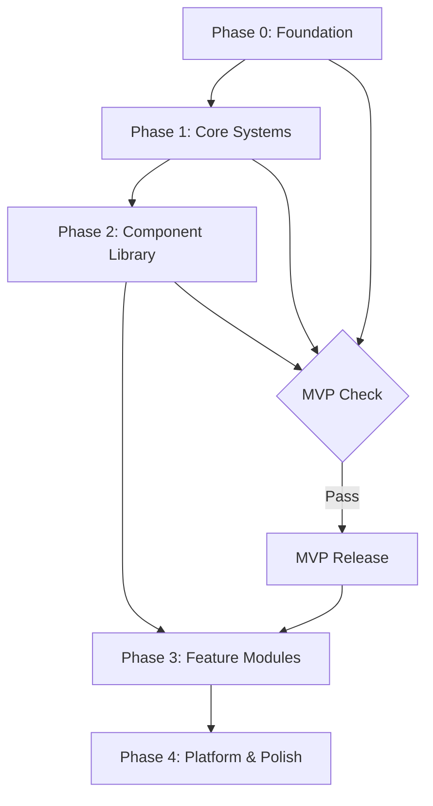

# PMNative Implementation Epic — Phases, Milestones & MVP

# PMNative Implementation Epic — Phases, Milestones & MVP

> This document defines the implementation roadmap for PMNative. It is organized into phases, each with clear milestones, deliverables, and success criteria. The MVP is defined explicitly so the team knows when the framework is "ready to use."

---

## 1. MVP Definition

The PMNative MVP is a working React Native framework template that a developer can clone and immediately use to bootstrap a mobile app. It is considered **MVP-complete** when:

### MVP Success Criteria

- [ ] A developer can clone the repo and run the app on iOS simulator, Android emulator, and web in under 5 minutes
- [ ] Changing 4 color values in `pm-native.config.ts` rebrands the entire app
- [ ] Enabling/disabling features in config structurally changes the app (tabs appear/disappear, auth screens show/hide)
- [ ] Authentication works end-to-end (email + configured social providers: login/register → session → protected screens → logout)
- [ ] The component library covers all common mobile UI patterns
- [ ] TypeScript is strict with zero `any` types in framework code
- [ ] Light and dark mode work correctly across all screens

### MVP Scope (What Ships)

| Category | Included in MVP |
|---|---|
| Config system | ✅ `pm-native.config.ts` with full type safety |
| Design tokens | ✅ 4-primitive system, semantic aliases, light/dark |
| Navigation | ✅ Auth flow + tab navigator + stack navigator |
| Authentication | ✅ Login, register, forgot password, session, logout, social auth scaffold (`Google`, `Telegram`, `VK`) |
| API layer | ✅ Fetch wrapper, Zod validation, error handling |
| Storage layer | ✅ MMKV + expo-secure-store abstraction |
| Component library | ✅ Atoms + Molecules (core set) |
| Hooks | ✅ useAuth, useConfig, useTheme, useToast |
| i18n | ✅ Basic i18next setup with English |
| RBAC | ✅ Role-based route protection |
| Theme system | ✅ Light/dark mode |
| TypeScript | ✅ Strict mode, all types defined |

### MVP Non-Scope (Post-MVP)

| Category | Post-MVP |
|---|---|
| 2FA | Phase 3 |
| Biometric auth | Phase 3 |
| Push notifications | Phase 3 |
| Offline sync | Phase 3 |
| Admin screens | Phase 3 |
| Multi-language | Phase 3 |
| Web optimization | Phase 4 |
| CLI/init wizard | Phase 4 |
| Documentation site | Phase 4 |

---

## 2. Phase Overview



---

## 3. Phase 0 — Foundation Setup

**Goal:** Establish the project skeleton, tooling, and core conventions.

**Duration:** ~1 week

### Milestones

#### M0.1 — Project Initialization
- Expo managed workflow with TypeScript strict mode
- Folder structure as defined in architecture spec
- ESLint + Prettier configuration (mirrors PM Framework conventions)
- Path aliases (`@/components`, `@/hooks`, `@/theme`, etc.)
- Git hooks (pre-commit lint + type check)

#### M0.2 — Config System
- `pm-native.config.ts` with full TypeScript types
- `types/config.ts` with all config interfaces
- `useConfig()` hook that reads from config
- Config validation at startup (Zod schema)
- RBAC types and helpers (ported from PM's `types/config.ts`)

#### M0.3 — Design Token System
- `theme/tokens.ts` — 4 color primitives + spacing + typography
- `theme/semantic.ts` — auto-calculated semantic tokens (light + dark)
- `useTheme()` hook — returns current theme tokens
- Light/dark mode detection via `useColorScheme`
- Manual theme override (stored in MMKV)

### Deliverables
- Working Expo project that boots on iOS, Android, and web
- Config system with type safety
- Design token system with light/dark support
- All tooling configured

---

## 4. Phase 1 — Core Systems

**Goal:** Implement the foundational systems that every app needs: navigation, auth, API, and storage.

**Duration:** ~2 weeks

### Milestones

#### M1.1 — Navigation Structure
- Expo Router setup with group-based routing
- Auth group `(auth)/` — login, register, forgot-password screens
- Tabs group `(tabs)/` — config-driven tab navigator
- Root layout with all providers (theme, query, i18n, auth)
- Auth guard — redirect unauthenticated users to login
- Role guard — redirect unauthorized users
- Deep linking configuration
- Safe area handling via `expo-safe-area-context`

#### M1.2 — Authentication System
- `useAuth()` hook (mirrors PM's `useAuth` composable)
- Login screen with form validation
- Register screen with form validation
- Forgot password screen
- Out-of-the-box social auth UX for `Google`, `Telegram`, `VK` (provider-configurable visibility)
- OAuth/deep-link callback handling for native + web-compatible flow
- Provider capability checks with graceful fallback (`NOT_SUPPORTED` / hidden actions)
- JWT storage in `expo-secure-store`
- Session check on app launch
- Auto token refresh
- Logout with token cleanup
- Account lockout handling (display lockout message)

#### M1.3 — API Layer
- Base API client (`services/api.ts`)
- Auth header injection (Bearer token)
- Zod response validation (same philosophy as PM)
- Structured error handling (`createApiError()`)
- Retry logic with exponential backoff
- 401 → token refresh → retry flow
- Offline detection and graceful degradation
- TanStack Query integration

#### M1.4 — Storage Layer
- MMKV setup and abstraction (`services/storage.service.ts`)
- `expo-secure-store` abstraction for sensitive data
- Storage keys as typed constants
- Migration utilities (for app updates)

### Deliverables
- Complete navigation flow (auth → tabs)
- Working authentication (login → session → logout)
- API layer with auth and error handling
- Storage layer with secure and fast storage

---

## 5. Phase 2 — Component Library

**Goal:** Build the atomic component library that all screens will use.

**Duration:** ~2 weeks

### Milestones

#### M2.1 — Atom Components

| Component | Variants |
|---|---|
| `Button` | primary, secondary, outline, ghost, destructive; sizes: sm, md, lg |
| `Text` | h1-h4, body, caption, label; weight variants |
| `Input` | default, error, disabled; with label and helper text |
| `Icon` | Tabler icon wrapper with size and color tokens |
| `Avatar` | image with initials fallback; sizes: sm, md, lg |
| `Badge` | success, warning, error, info, neutral |
| `Divider` | horizontal and vertical |
| `Spinner` | sizes: sm, md, lg; with overlay variant |
| `Switch` | with label |
| `Checkbox` | with label and indeterminate state |

All atoms:
- Use design tokens exclusively (no hardcoded colors/sizes)
- Support light and dark mode automatically
- Have TypeScript props with JSDoc
- Meet 44×44pt minimum touch target

#### M2.2 — Molecule Components

| Component | Description |
|---|---|
| `FormField` | Label + Input + error message + helper text |
| `ListItem` | Row with leading icon/avatar, title, subtitle, trailing action |
| `Card` | Elevated container with optional header/footer |
| `EmptyState` | Icon + title + description + optional CTA |
| `ErrorState` | Error icon + message + retry button |
| `SearchBar` | Input with search icon and clear button |
| `SectionHeader` | Section title with optional action |
| `KeyboardAvoidingView` | Wrapper that handles keyboard on iOS/Android |

#### M2.3 — Organism Components

| Component | Description |
|---|---|
| `LoginForm` | Complete login form (email, password, submit, forgot password link) |
| `RegisterForm` | Complete registration form |
| `ToastContainer` | Toast notification system (success, error, warning, info) |
| `ConfirmDialog` | Modal confirmation dialog |
| `BottomSheet` | Gesture-driven bottom sheet |
| `ScreenHeader` | Screen header with back button, title, actions |

#### M2.4 — Loading & Skeleton States

| Component | Description |
|---|---|
| `SkeletonText` | Animated text placeholder |
| `SkeletonCard` | Animated card placeholder |
| `SkeletonList` | Animated list placeholder |
| `LoadingOverlay` | Full-screen loading overlay |

### Deliverables
- Complete atom library (10 components)
- Complete molecule library (8 components)
- Complete organism library (6 components)
- Loading/skeleton states
- All components documented with TypeScript types

---

## 6. Phase 3 — Feature Modules

**Goal:** Build the out-of-the-box feature modules that ship with PMNative.

**Duration:** ~2 weeks

### Milestones

#### M3.1 — User Profile Module
- Profile screen (avatar, name, email, role badge)
- Edit profile screen (name, avatar upload)
- Change password screen
- `useProfile()` hook

#### M3.2 — Settings Module
- Settings screen (config-driven list)
- Theme toggle (light/dark/system)
- Language selector (if multi-language enabled)
- Notification preferences
- Account section (change password, logout, delete account)
- `useSettings()` hook

#### M3.3 — Notification Center
- Push notification setup (expo-notifications)
- Permission request flow
- Notification list screen
- Notification badge on tab bar
- `useNotifications()` hook

#### M3.4 — Two-Factor Authentication
- 2FA setup screen (QR code + manual entry)
- 2FA verification screen (TOTP input)
- Backup codes screen
- 2FA disable flow
- Mirrors PM Framework's 2FA implementation

#### M3.5 — Admin Module
- Users list screen (role-gated: admin+)
- User detail/edit screen
- App settings screen (key-value settings)
- Role management screen (master only)
- `useAdmin()` hook

#### M3.6 — Help & Support Module (adapted from PM's FAQ/Contact)
- Help center screen (FAQ-style)
- Support form screen (contact form adapted for mobile)
- `useHelp()` hook

#### M3.7 — Offline Support
- TanStack Query persistence (offline cache)
- Optimistic updates for mutations
- Offline indicator component
- Background sync on reconnect
- Queue system for offline mutations

### Deliverables
- User profile module
- Settings module
- Push notifications
- 2FA support
- Admin screens
- Help/support module
- Offline-ready data layer

---

## 7. Phase 4 — Platform & Polish

**Goal:** Web compatibility, performance, testing, documentation, and developer tooling.

**Duration:** ~2 weeks

### Milestones

#### M4.1 — Web Compatibility
- React Native Web audit (all components render correctly on web)
- Platform-specific overrides where needed (`.web.tsx` files)
- Web-specific layout adjustments (max-width container for wide screens)
- Web navigation (URL routing via Expo Router)
- Web font loading (Google Fonts for web)

#### M4.2 — Performance Optimization
- FlashList for all long lists (replaces FlatList)
- Image optimization (expo-image with caching)
- Bundle size audit
- Lazy loading for non-critical screens
- Memoization audit (React.memo, useMemo, useCallback)
- Native driver for all animations

#### M4.3 — Testing Setup
- Jest + React Native Testing Library configuration
- Test utilities (render with providers, mock hooks)
- Unit tests for all hooks
- Unit tests for all utility functions
- Integration tests for auth flow
- Snapshot tests for key components

#### M4.4 — Developer Tooling
- `pm-native init` CLI wizard (mirrors PM's `npm run init`)
  - App name, bundle ID
  - Color primitives
  - Feature selection
  - Module selection
- Storybook for React Native (component documentation)
- `pm-native.config.ts` JSON schema for IDE autocomplete

#### M4.5 — Documentation
- README with quick start guide
- Architecture overview
- Config reference
- Component library reference
- Hook reference
- Migration guide (for PM Framework users)
- Example apps (simple todo, social feed, e-commerce shell)

### Deliverables
- Web-compatible build
- Performance-optimized app
- Test suite with >80% coverage on hooks/utils
- CLI init wizard
- Storybook component docs
- Full documentation

---

## 8. Ticket Breakdown by Phase

### Phase 0 Tickets
- `PMN-001` — Expo project initialization with TypeScript strict mode
- `PMN-002` — Folder structure and path aliases
- `PMN-003` — ESLint + Prettier configuration
- `PMN-004` — `pm-native.config.ts` and config types
- `PMN-005` — `useConfig()` hook implementation
- `PMN-006` — Design token system (primitives + semantic)
- `PMN-007` — `useTheme()` hook with light/dark support

### Phase 1 Tickets
- `PMN-010` — Expo Router setup with group routing
- `PMN-011` — Root layout with all providers
- `PMN-012` — Auth guard and role guard
- `PMN-013` — Login screen
- `PMN-014` — Register screen
- `PMN-015` — Forgot password screen
- `PMN-016` — `useAuth()` hook
- `PMN-017` — JWT storage with expo-secure-store
- `PMN-018` — Base API client with Zod validation
- `PMN-019` — TanStack Query setup
- `PMN-020` — MMKV storage service
- `PMN-021` — Out-of-the-box social auth (`Google`, `Telegram`, `VK`) + OAuth callback handling

### Phase 2 Tickets
- `PMN-030` — Atom: Button component
- `PMN-031` — Atom: Text component
- `PMN-032` — Atom: Input component
- `PMN-033` — Atom: Icon component
- `PMN-034` — Atom: Avatar, Badge, Divider, Spinner, Switch, Checkbox
- `PMN-040` — Molecule: FormField component
- `PMN-041` — Molecule: ListItem component
- `PMN-042` — Molecule: Card, EmptyState, ErrorState, SearchBar
- `PMN-050` — Organism: LoginForm
- `PMN-051` — Organism: RegisterForm
- `PMN-052` — Organism: ToastContainer + useToast hook
- `PMN-053` — Organism: ConfirmDialog + useConfirm hook
- `PMN-054` — Organism: BottomSheet, ScreenHeader
- `PMN-060` — Skeleton/loading states

### Phase 3 Tickets
- `PMN-070` — User profile module
- `PMN-071` — Settings module
- `PMN-072` — Push notifications
- `PMN-073` — Two-factor authentication
- `PMN-074` — Admin module (users, settings, roles)
- `PMN-075` — Help/support module
- `PMN-076` — Offline support layer

### Phase 4 Tickets
- `PMN-080` — Web compatibility audit and fixes
- `PMN-081` — Performance optimization
- `PMN-082` — Testing setup and test suite
- `PMN-083` — CLI init wizard
- `PMN-084` — Storybook setup
- `PMN-085` — Documentation

---

## 9. Key Wireframes

### 9.1 App Shell — Tab Navigation

```wireframe
<!DOCTYPE html>
<html>
<head>
<style>
* { box-sizing: border-box; margin: 0; padding: 0; font-family: system-ui, sans-serif; }
body { background: #f5f5f5; display: flex; justify-content: center; padding: 20px; }
.phone { width: 375px; height: 812px; background: #fff; border-radius: 40px; border: 2px solid #ccc; overflow: hidden; display: flex; flex-direction: column; box-shadow: 0 8px 32px rgba(0,0,0,0.15); }
.status-bar { height: 44px; background: #fff; display: flex; align-items: center; justify-content: space-between; padding: 0 20px; font-size: 12px; color: #333; border-bottom: 1px solid #eee; }
.screen-header { height: 56px; background: #fff; display: flex; align-items: center; padding: 0 16px; border-bottom: 1px solid #eee; }
.screen-title { font-size: 17px; font-weight: 600; color: #2f2f2f; }
.content { flex: 1; overflow: hidden; padding: 16px; background: #f5f5f5; }
.card { background: #fff; border-radius: 12px; padding: 16px; margin-bottom: 12px; box-shadow: 0 1px 4px rgba(0,0,0,0.08); }
.card-title { font-size: 14px; font-weight: 600; color: #2f2f2f; margin-bottom: 4px; }
.card-sub { font-size: 12px; color: #888; }
.skeleton { background: #e5e5e5; border-radius: 4px; }
.sk-line { height: 12px; margin-bottom: 8px; }
.sk-line.short { width: 60%; }
.sk-line.medium { width: 80%; }
.tab-bar { height: 83px; background: #fff; border-top: 1px solid #eee; display: flex; align-items: flex-start; padding-top: 8px; }
.tab { flex: 1; display: flex; flex-direction: column; align-items: center; gap: 4px; cursor: pointer; }
.tab-icon { width: 24px; height: 24px; border-radius: 4px; background: #e5e5e5; }
.tab-icon.active { background: #aa0000; }
.tab-label { font-size: 10px; color: #888; }
.tab-label.active { color: #aa0000; font-weight: 600; }
.badge { width: 8px; height: 8px; background: #aa0000; border-radius: 50%; position: absolute; top: -2px; right: -2px; }
.tab-wrap { position: relative; display: inline-block; }
</style>
</head>
<body>
<div class="phone">
  <div class="status-bar">
    <span>9:41</span>
    <span>●●● WiFi 🔋</span>
  </div>
  <div class="screen-header">
    <span class="screen-title">Home</span>
  </div>
  <div class="content">
    <div class="card">
      <div class="card-title">Welcome back, Alex</div>
      <div class="card-sub">Here's what's new today</div>
    </div>
    <div class="card">
      <div class="skeleton sk-line medium"></div>
      <div class="skeleton sk-line short"></div>
    </div>
    <div class="card">
      <div class="skeleton sk-line medium"></div>
      <div class="skeleton sk-line short"></div>
    </div>
    <div class="card">
      <div class="skeleton sk-line medium"></div>
      <div class="skeleton sk-line short"></div>
    </div>
  </div>
  <div class="tab-bar">
    <div class="tab">
      <div class="tab-icon active"></div>
      <span class="tab-label active">Home</span>
    </div>
    <div class="tab">
      <div class="tab-wrap">
        <div class="tab-icon"></div>
        <div class="badge"></div>
      </div>
      <span class="tab-label">Inbox</span>
    </div>
    <div class="tab">
      <div class="tab-icon"></div>
      <span class="tab-label">Profile</span>
    </div>
    <div class="tab">
      <div class="tab-icon"></div>
      <span class="tab-label">Settings</span>
    </div>
  </div>
</div>
</body>
</html>
```

### 9.2 Authentication — Login Screen

```wireframe
<!DOCTYPE html>
<html>
<head>
<style>
* { box-sizing: border-box; margin: 0; padding: 0; font-family: system-ui, sans-serif; }
body { background: #f5f5f5; display: flex; justify-content: center; padding: 20px; }
.phone { width: 375px; height: 812px; background: #fff; border-radius: 40px; border: 2px solid #ccc; overflow: hidden; display: flex; flex-direction: column; box-shadow: 0 8px 32px rgba(0,0,0,0.15); }
.status-bar { height: 44px; background: #fff; display: flex; align-items: center; justify-content: space-between; padding: 0 20px; font-size: 12px; color: #333; }
.content { flex: 1; padding: 32px 24px; display: flex; flex-direction: column; }
.logo-area { display: flex; flex-direction: column; align-items: center; margin-bottom: 40px; }
.logo-box { width: 64px; height: 64px; background: #aa0000; border-radius: 16px; margin-bottom: 12px; }
.app-name { font-size: 22px; font-weight: 700; color: #2f2f2f; }
.app-sub { font-size: 13px; color: #888; margin-top: 4px; }
.form { display: flex; flex-direction: column; gap: 16px; }
.field { display: flex; flex-direction: column; gap: 6px; }
.label { font-size: 13px; font-weight: 500; color: #2f2f2f; }
.input { height: 48px; border: 1.5px solid #e5e5e5; border-radius: 10px; padding: 0 14px; font-size: 15px; color: #2f2f2f; background: #fafafa; }
.input.focused { border-color: #aa0000; background: #fff; }
.btn-primary { height: 52px; background: #aa0000; border-radius: 12px; display: flex; align-items: center; justify-content: center; margin-top: 8px; }
.btn-text { color: #fff; font-size: 16px; font-weight: 600; }
.forgot { text-align: center; margin-top: 16px; font-size: 13px; color: #aa0000; }
.divider { display: flex; align-items: center; gap: 12px; margin: 20px 0; }
.div-line { flex: 1; height: 1px; background: #e5e5e5; }
.div-text { font-size: 12px; color: #aaa; }
.register-row { text-align: center; font-size: 13px; color: #888; }
.register-link { color: #aa0000; font-weight: 600; }
</style>
</head>
<body>
<div class="phone">
  <div class="status-bar">
    <span>9:41</span>
    <span>●●● WiFi 🔋</span>
  </div>
  <div class="content">
    <div class="logo-area">
      <div class="logo-box"></div>
      <div class="app-name">PMNative App</div>
      <div class="app-sub">Sign in to continue</div>
    </div>
    <div class="form">
      <div class="field">
        <div class="label">Email</div>
        <div class="input focused">alex@example.com</div>
      </div>
      <div class="field">
        <div class="label">Password</div>
        <div class="input">••••••••</div>
      </div>
      <div class="btn-primary">
        <span class="btn-text">Sign In</span>
      </div>
      <div class="forgot">Forgot password?</div>
      <div class="divider">
        <div class="div-line"></div>
        <div class="div-text">or</div>
        <div class="div-line"></div>
      </div>
      <div class="register-row">
        Don't have an account? <span class="register-link">Sign up</span>
      </div>
    </div>
  </div>
</div>
</body>
</html>
```

### 9.3 Settings Screen

```wireframe
<!DOCTYPE html>
<html>
<head>
<style>
* { box-sizing: border-box; margin: 0; padding: 0; font-family: system-ui, sans-serif; }
body { background: #f5f5f5; display: flex; justify-content: center; padding: 20px; }
.phone { width: 375px; height: 812px; background: #f5f5f5; border-radius: 40px; border: 2px solid #ccc; overflow: hidden; display: flex; flex-direction: column; box-shadow: 0 8px 32px rgba(0,0,0,0.15); }
.status-bar { height: 44px; background: #f5f5f5; display: flex; align-items: center; justify-content: space-between; padding: 0 20px; font-size: 12px; color: #333; }
.screen-header { height: 56px; background: #f5f5f5; display: flex; align-items: center; padding: 0 16px; }
.screen-title { font-size: 28px; font-weight: 700; color: #2f2f2f; }
.content { flex: 1; overflow: hidden; padding: 0 16px; }
.section-label { font-size: 12px; font-weight: 600; color: #888; text-transform: uppercase; letter-spacing: 0.5px; padding: 16px 4px 8px; }
.settings-group { background: #fff; border-radius: 12px; overflow: hidden; margin-bottom: 4px; }
.setting-row { display: flex; align-items: center; padding: 14px 16px; border-bottom: 1px solid #f0f0f0; }
.setting-row:last-child { border-bottom: none; }
.setting-icon { width: 32px; height: 32px; border-radius: 8px; background: #aa0000; margin-right: 12px; flex-shrink: 0; }
.setting-icon.gray { background: #888; }
.setting-icon.blue { background: #0f172a; }
.setting-icon.green { background: #4ade80; }
.setting-info { flex: 1; }
.setting-title { font-size: 15px; color: #2f2f2f; }
.setting-sub { font-size: 12px; color: #888; margin-top: 1px; }
.setting-action { font-size: 13px; color: #aaa; }
.toggle { width: 44px; height: 26px; background: #aa0000; border-radius: 13px; position: relative; }
.toggle-dot { width: 22px; height: 22px; background: #fff; border-radius: 50%; position: absolute; top: 2px; right: 2px; }
.tab-bar { height: 83px; background: #fff; border-top: 1px solid #eee; display: flex; align-items: flex-start; padding-top: 8px; }
.tab { flex: 1; display: flex; flex-direction: column; align-items: center; gap: 4px; }
.tab-icon { width: 24px; height: 24px; border-radius: 4px; background: #e5e5e5; }
.tab-icon.active { background: #aa0000; }
.tab-label { font-size: 10px; color: #888; }
.tab-label.active { color: #aa0000; font-weight: 600; }
</style>
</head>
<body>
<div class="phone">
  <div class="status-bar">
    <span>9:41</span>
    <span>●●● WiFi 🔋</span>
  </div>
  <div class="screen-header">
    <span class="screen-title">Settings</span>
  </div>
  <div class="content">
    <div class="section-label">Appearance</div>
    <div class="settings-group">
      <div class="setting-row">
        <div class="setting-icon"></div>
        <div class="setting-info">
          <div class="setting-title">Dark Mode</div>
          <div class="setting-sub">Currently: System</div>
        </div>
        <div class="toggle"><div class="toggle-dot"></div></div>
      </div>
      <div class="setting-row">
        <div class="setting-icon blue"></div>
        <div class="setting-info">
          <div class="setting-title">Language</div>
          <div class="setting-sub">English</div>
        </div>
        <div class="setting-action">›</div>
      </div>
    </div>
    <div class="section-label">Account</div>
    <div class="settings-group">
      <div class="setting-row">
        <div class="setting-icon gray"></div>
        <div class="setting-info">
          <div class="setting-title">Change Password</div>
        </div>
        <div class="setting-action">›</div>
      </div>
      <div class="setting-row">
        <div class="setting-icon green"></div>
        <div class="setting-info">
          <div class="setting-title">Two-Factor Auth</div>
          <div class="setting-sub">Not enabled</div>
        </div>
        <div class="setting-action">›</div>
      </div>
    </div>
    <div class="section-label">Support</div>
    <div class="settings-group">
      <div class="setting-row">
        <div class="setting-icon gray"></div>
        <div class="setting-info">
          <div class="setting-title">Help Center</div>
        </div>
        <div class="setting-action">›</div>
      </div>
      <div class="setting-row">
        <div class="setting-icon"></div>
        <div class="setting-info">
          <div class="setting-title">Contact Support</div>
        </div>
        <div class="setting-action">›</div>
      </div>
    </div>
  </div>
  <div class="tab-bar">
    <div class="tab"><div class="tab-icon"></div><span class="tab-label">Home</span></div>
    <div class="tab"><div class="tab-icon"></div><span class="tab-label">Inbox</span></div>
    <div class="tab"><div class="tab-icon"></div><span class="tab-label">Profile</span></div>
    <div class="tab"><div class="tab-icon active"></div><span class="tab-label active">Settings</span></div>
  </div>
</div>
</body>
</html>
```

---

## 10. Timeline Summary

| Phase | Duration | Key Milestone |
|---|---|---|
| **Phase 0** — Foundation | Week 1 | Project boots, config system, design tokens |
| **Phase 1** — Core Systems | Weeks 2–3 | Auth works, navigation complete, API layer |
| **Phase 2** — Component Library | Weeks 4–5 | Full atom + molecule + organism library |
| **MVP Release** | End of Week 5 | Framework is usable for bootstrapping apps |
| **Phase 3** — Feature Modules | Weeks 6–7 | Profile, settings, notifications, 2FA, admin |
| **Phase 4** — Platform & Polish | Weeks 8–9 | Web compat, tests, CLI, docs |
| **v1.0 Release** | End of Week 9 | Full framework release |

---

## 11. PMNative vs PM Framework — Final Philosophy Statement

> **PM Framework** is a web-first framework for building websites and web apps. Its primary design target is the browser. It excels at marketing sites, landing pages, content-driven websites, and web applications with an admin panel.

> **PMNative** is a mobile-first framework for building native mobile apps. Its primary design target is iOS and Android. It excels at product apps, consumer apps, B2B mobile tools, and any application where the native mobile experience is the core product.

> **The relationship:** PMNative inherits the conceptual DNA of PM Framework — config-first architecture, 4-primitive design tokens, atomic component discipline, RBAC, typed and validated, security-first — but re-expresses this DNA in the React Native paradigm. It is not a port. It is an evolution.

> **The guiding principle:** A developer who knows PM Framework should feel immediately at home in PMNative. The mental model is the same. The tools are different. The philosophy is shared.
