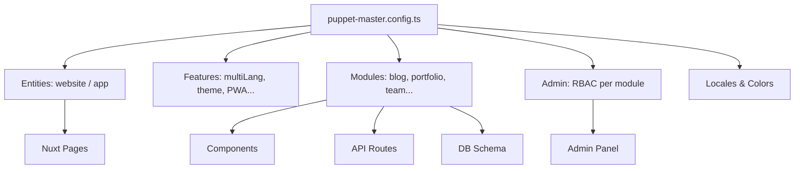

# PM Framework Deep Analysis — DNA Extraction for PMNative

# PM Framework Deep Analysis — DNA Extraction for PMNative

> **Purpose:** This document is the authoritative analysis of the existing Puppet Master Framework. It identifies what is platform-agnostic, what is web-specific, and what conceptual DNA should be inherited by PMNative. It is not a migration guide — it is an extraction guide.

---

## 1. Philosophy & Core Principles

### 1.1 The PM Framework Philosophy

The PM Framework is built around five core principles that are **entirely platform-agnostic**:

| Principle | Description | Platform-Agnostic? |
|---|---|---|
| **Config-first** | `puppet-master.config.ts` is the single source of truth for all behavior | ✅ Yes |
| **Global styles only** | No scoped styles; all styling via a shared system | ✅ Yes (concept) |
| **Atomic design discipline** | Components follow atoms → molecules → organisms → sections | ✅ Yes |
| **Typed and validated** | TypeScript everywhere, Zod for API validation | ✅ Yes |
| **Security and auditability** | RBAC, audit logs, 2FA, account lockout | ✅ Yes |
| **Performance obsession** | Every architectural decision optimizes for speed; slow is never acceptable | ✅ Yes |
| **Universal surface targeting** | The style system is built to work on every screen size out of the box | ✅ Yes |

The framework's **developer experience goal** is clear: a developer should be able to bootstrap a production-ready project by editing a single config file. This is the most important concept to carry forward into PMNative.

### 1.2 What Makes PM Unique

- **Database-driven i18n**: Translations live in the database, not in files. This allows runtime editing without redeployment.
- **4-primitive color system**: The entire visual identity derives from just 4 hex values. Rebranding = changing 4 values.
- **Modular feature flags**: Every feature module can be enabled/disabled via config. The app adapts structurally, not just visually.
- **RBAC at the config level**: Role-based access is declared in config, not scattered across code.

---

## 2. Architecture Analysis

### 2.1 Module Organization



The config file (`puppet-master.config.ts`, ~917 lines) is the architectural hub. It drives:
- Which pages exist
- Which components render
- Which API routes are active
- Which admin sections appear
- Which roles can access what

### 2.2 State Management

PM uses a **hybrid state model**:
- **Pinia stores** — client-side reactive state (auth user, UI state)
- **`useState()` composables** — Nuxt SSR-compatible shared state
- **`useFetch()` / `$fetch()`** — server state (no dedicated server-state library)
- **Database** — persistent state (SQLite via Drizzle ORM)

The composable pattern (`useAuth`, `useConfig`, `useToast`, `useConfirm`) is the primary interface for components. This pattern is **directly translatable** to React hooks.

### 2.3 Routing Model

PM uses Nuxt's file-based routing:
- `app/pages/index.vue` → `/`
- `app/pages/admin/users.vue` → `/admin/users`
- `app/pages/[section].vue` → dynamic section routing

The routing is **web-first** (URL-based, SSR-aware). The concept of file-based routing is excellent and should be preserved in PMNative via Expo Router.

### 2.4 Dependency Structure

| Layer | Technology | Platform-Agnostic? |
|---|---|---|
| Framework | Nuxt 4 (Vue 3 + Nitro) | ❌ Web-specific |
| Routing | Vue Router (file-based) | ❌ Web-specific |
| State | Pinia | ❌ Vue-specific |
| Styling | Pure CSS (5-layer) | ❌ Web-specific |
| Database | SQLite + Drizzle ORM | ✅ Concept yes |
| Validation | Zod | ✅ Yes |
| Auth | Session cookies + CSRF | ❌ Web-specific |
| i18n | vue-i18n + DB loader | ❌ Vue-specific |
| Icons | Tabler (unplugin-icons) | ❌ Web-specific |

---

## 3. Style System Analysis

### 3.1 The 4-Primitive Color System

The most elegant concept in PM's style system. The entire visual identity derives from:

```
--p-black:  #2f2f2f   (charcoal — dark text)
--p-white:  #f0f0f0   (off-white — light text)
--p-brand:  #aa0000   (dark red — primary accent)
--p-accent: #0f172a   (deep slate — secondary contrast)
```

Everything else — backgrounds, borders, hover states, semantic colors — is **auto-calculated** via `color-mix()` and `light-dark()`. This is a **brilliant concept** that translates perfectly to a JS token system in React Native.

### 3.2 The 5-Layer CSS Architecture

| Layer | Purpose | RN Equivalent |
|---|---|---|
| `reset` | CSS normalize | Not needed (RN has no browser defaults) |
| `primitives` | Raw values (colors, fonts) | Design tokens object |
| `semantic` | Derived values | Semantic token aliases |
| `components` | UI styling | StyleSheet per component |
| `utilities` | Override helpers | Utility style objects |

The **layering philosophy** (primitives → semantic → components → utilities) is platform-agnostic and should be preserved in PMNative's token system.

### 3.3 Typography System

PM uses a 4-layer typography architecture:
1. **Fallback stacks** — system fonts
2. **Brand fonts** — client-specific (Montserrat by default)
3. **Semantic aliases** — `--font-body`, `--font-heading`, `--font-ui`
4. **Sizes & spacing** — `--text-xs` through `--text-6xl`

This translates directly to a React Native font token system. The semantic alias layer is especially valuable — components reference `tokens.font.body`, not specific font names.

### 3.4 What Is Web-Specific in the Style System

- `color-mix()` and `light-dark()` CSS functions
- CSS custom properties (`--variable-name`)
- CSS layers (`@layer`)
- BEM class naming
- `postcss-preset-env` processing
- `@font-face` declarations
- Media queries for responsive layout
- `:dir(rtl)` selectors

---

## 4. Module-by-Module Analysis

### 4.1 Core Infrastructure Modules

| Module | Description | PMNative Decision | Rationale |
|---|---|---|---|
| **Config System** | `puppet-master.config.ts` | 🟡 Adapt | Core concept preserved; mobile-specific options replace web options |
| **RBAC / Roles** | Role hierarchy, permissions | ✅ Reuse | Fully platform-agnostic logic |
| **Authentication** | Login, session, 2FA, CSRF | 🟡 Adapt | Logic reused; implementation changes (JWT/secure storage vs cookies) |
| **Audit Logging** | Security event tracking | 🟡 Adapt | Concept preserved; mobile event model differs |
| **Atomic Design** | atoms/molecules/organisms | 🔄 Rebuild | Pattern preserved; all components rebuilt as RN components |
| **Composables/Hooks** | `useAuth`, `useConfig`, etc. | 🔄 Rebuild | Vue composables → React hooks; same API surface |
| **i18n System** | DB-driven translations | 🟡 Adapt | Concept preserved; bundled translations + optional remote sync |
| **API Layer** | Zod validation, error handling | 🟡 Adapt | Patterns preserved; client-side fetch wrapper rebuilt |
| **Settings Store** | Key-value settings in DB | 🟡 Adapt | Concept preserved; mobile uses MMKV/AsyncStorage |

### 4.2 Content Modules (Website-Specific)

| Module | Description | PMNative Decision | Rationale |
|---|---|---|---|
| **Blog** | Posts, categories, tags | ❌ Remove | Web/marketing content feature |
| **Portfolio** | Project showcase, galleries | ❌ Remove | Web/marketing feature |
| **Team** | Team member profiles | ❌ Remove | Web/marketing feature |
| **Testimonials** | Customer reviews | ❌ Remove | Web/marketing feature |
| **Clients** | Client/partner logos | ❌ Remove | Web/marketing feature |
| **Features/Services** | Feature cards | ❌ Remove | Web/marketing feature |
| **Pricing** | Pricing tiers | ❌ Remove | Web marketing; mobile uses IAP |
| **Contact Form** | Contact submissions | 🟡 Adapt | Becomes in-app support/feedback form |
| **FAQ** | Questions & answers | 🟡 Adapt | Becomes in-app help center |

### 4.3 Admin Panel Modules

| Module | Description | PMNative Decision | Rationale |
|---|---|---|---|
| **Users** | User management | 🔄 Rebuild | Concept preserved; rebuilt as native admin screen |
| **Roles** | Dynamic role management | 🔄 Rebuild | Concept preserved; rebuilt as native screen |
| **Settings** | App settings management | 🔄 Rebuild | Concept preserved; rebuilt as native settings screen |
| **Health** | System health monitoring | 🟡 Adapt | Concept preserved; mobile-specific health metrics |
| **Translations** | i18n management | 🟡 Adapt | Concept preserved; mobile translation management |
| **Contacts** | Contact form submissions | ❌ Remove | Web-specific (contact form) |
| **Blog/Portfolio/etc.** | Content management | ❌ Remove | Web-specific content modules |

### 4.4 Website/Navigation Modules

| Module | Description | PMNative Decision | Rationale |
|---|---|---|---|
| **TheHeader** | Website header | ❌ Remove | Web navigation pattern |
| **TheFooter** | Website footer | ❌ Remove | Web navigation pattern |
| **AppBottomNav** | Mobile bottom nav | ✅ Reuse concept | Already mobile-first! |
| **SectionRenderer** | Dynamic section rendering | ❌ Remove | Web onepager feature |
| **ScrollSpy** | Section tracking | ❌ Remove | Web onepager feature |
| **ScrollHeader** | Header scroll effects | ❌ Remove | Web-specific |
| **PageTransitions** | CSS page transitions | ❌ Remove | Web-specific |
| **PWA** | Progressive Web App | ❌ Remove | Web-specific |

---

## 5. Web-Specific Features — Explicit Exclusion List

The following features exist in PM Framework **specifically for web/marketing** and must **not** be included in PMNative:

### 5.1 Landing Page System
- `SectionHero`, `SectionAbout`, `SectionPortfolio`, `SectionBlog`, `SectionTeam`, `SectionTestimonials`, `SectionFeatures`, `SectionClients`, `SectionPricing`, `SectionContact`
- `SectionRenderer` (dynamic section composition)
- Onepager mode (`features.onepager`)
- `[section].vue` dynamic routing

### 5.2 SEO & Marketing Infrastructure
- Meta tags, Open Graph, structured data
- Sitemap generation
- `@nuxtjs/critters` (critical CSS inlining)
- PurgeCSS (unused CSS removal)
- Google Fonts integration
- `viewport-fit=cover` (iOS notch — relevant for native, not web)

### 5.3 Website Navigation
- `TheHeader` with scroll effects
- `TheFooter` with legal info
- `useScrollHeader`, `useScrollSpy`
- `useAdaptiveNav` (hamburger menu)
- `HamburgerIcon` component
- `BackToTop` button

### 5.4 CMS-Like Tooling
- Blog post editor with rich text
- Portfolio gallery management
- Team member profiles
- Testimonial management
- Client logo management
- Pricing tier management

### 5.5 Web-Only Technical Features
- PWA manifest and service worker
- CSS `@layer` architecture
- `postcss-preset-env` processing
- `color-mix()` / `light-dark()` CSS functions
- CSRF token protection (web session model)
- Cookie-based sessions

---

## 6. Philosophy Comparison: PM Framework vs PMNative

| Dimension | PM Framework | PMNative |
|---|---|---|
| **Primary target** | Web browsers | iOS & Android native |
| **Secondary target** | — | Web (React Native Web) |
| **Rendering model** | SSR (Nuxt/Nitro) | Native rendering + optional web |
| **Styling approach** | Pure CSS, 5-layer architecture | JS design tokens, StyleSheet API |
| **Routing** | URL-based, file-based (Nuxt) | Screen-based, file-based (Expo Router) |
| **Navigation paradigm** | Header + footer + URL | Bottom tabs + stack + drawer |
| **State management** | Pinia + useState | Zustand + React Query |
| **Auth model** | Cookie sessions + CSRF | JWT + secure storage |
| **i18n** | DB-driven, runtime editable | Bundled + optional remote sync |
| **Content modules** | Blog, portfolio, team, etc. | App-specific data modules |
| **Admin panel** | Web admin at `/admin` | In-app admin screens or separate app |
| **Config philosophy** | `puppet-master.config.ts` | `pm-native.config.ts` |
| **Component model** | Vue SFCs, global CSS | React Native components, StyleSheet |
| **Developer goal** | Bootstrap a website fast | Bootstrap a mobile app fast |
| **Performance stance** | Important, but web has more tolerance | **Core value** — Hermes, native driver, virtualization by default |
| **Device targeting** | Modern browsers (browserslist) | **All devices** — flagship to old; graceful degradation, no hard floor |
| **Surface targeting** | Desktop web primary, mobile responsive | **All 5 surfaces** — phone, tablet, web, desktop, TV — out of the box |

### The Shared DNA

Despite the differences, PMNative inherits the following from PM Framework:

1. **Config-first architecture** — one file drives the entire app structure
2. **4-primitive design token system** — rebrand by changing 4 values
3. **Atomic design discipline** — atoms → molecules → organisms
4. **Composable/hook pattern** — `useAuth`, `useConfig`, `useToast`
5. **RBAC model** — role hierarchy with permission-based access
6. **Modular feature flags** — enable/disable features via config
7. **Typed and validated** — TypeScript + Zod everywhere
8. **Security-first** — audit logging, 2FA, account lockout
9. **Database-driven settings** — runtime-configurable behavior
10. **Developer experience obsession** — zero-config bootstrap, sensible defaults
11. **Performance obsession** — every decision optimizes for speed; slow is never acceptable
12. **Universal responsive system** — PM's "Holy Grail" responsive philosophy (fluid values, container queries, breakpoints) translated in full to React Native; every surface works out of the box
13. **All-device respect** — no hard device floor; graceful degradation ensures old devices get a working experience, not a broken one

> **The goal is not migration. The goal is evolution.**
> PMNative takes the conceptual DNA of PM Framework and re-expresses it in the native mobile paradigm.
